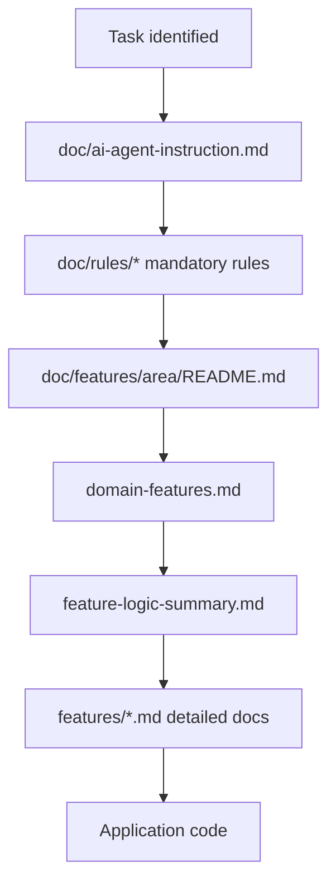

# Documentation — shopstack-timesheet

### Overview

This folder holds **repository-wide** documentation: how AI agents and developers should work in this codebase, where feature logic is documented, and which rules apply before implementation.

It is **not** the primary store for per-feature business logic. That lives under `doc/features/<feature-area>/`.

### Business Purpose

Provide a single entry point for engineering standards, documentation workflow, and navigation to canonical feature-area docs — reducing wrong assumptions about Zoho/Sheets contracts and timesheet rules during implementation and handover.

### User Roles and Permissions

| Role | Access | Actions |
|------|--------|---------|
| Developer / AI agent | Full `doc/` read | Follow resolution order before implementing |
| Technical writer | Feature-area docs under `doc/features/` | Author behavior docs per template |
| Stakeholder | README + feature-area READMEs | Understand scope and reading order |

Engineering rule files under `doc/rules/` govern mandatory completion gates; they are not end-user manuals.

### Workflow



### Use Cases

- **Onboard** — Learn repo documentation structure and team principles
- **Resolve feature area** — Use global index to pick correct `doc/features/<area>/`
- **Implement** — Read area docs in order, then code
- **Complete task** — Update feature docs + quality gates per `implementation_completion.md`

## Table of contents (files under `doc/`)

| Path | Purpose |
|------|---------|
| [README.md](./README.md) | This file: role of `doc/`, TOC, [team implementation principles](#team-implementation-principles), feature-area definition, resolution order. |
| [ai-agent-instruction.md](./ai-agent-instruction.md) | **Mandatory entry** for AI agents: workflow, rule files, completion gates, final report format. |
| [feature-logic-summary.md](./feature-logic-summary.md) | **Global navigation index**: links each feature area to `doc/features/`. |
| [prompt.md](./prompt.md) | Short reminder prompt for agents (copy/paste or session hint). |
| [rules/coding.md](./rules/coding.md) | Coding and architecture standards (App Router, BFF, lib, components). |
| [rules/testing.md](./rules/testing.md) | Testing standards (current gap + required cases when a runner exists). |
| [rules/lint.md](./rules/lint.md) | TypeScript and ESLint quality gates. |
| [rules/documentation.md](./rules/documentation.md) | Where and how to write feature docs and when to update them. |
| [rules/manual_documentation_template.md](./rules/manual_documentation_template.md) | Section template for detailed `features/*.md`. |
| [rules/implementation_completion.md](./rules/implementation_completion.md) | **Mandatory completion gate**: docs + quality checks on every implementation. |
| [rules/feature-area-documentation.md](./rules/feature-area-documentation.md) | Required structure and naming for `doc/features/<feature-area>/`. |

Root onboarding: [`README.md`](../README.md) and [`.env.example`](../.env.example). **Environment and integration setup** live in feature docs (especially `ops/environment-variables`, `auth` credentials setup, `master-data` Sheets setup, `reminders` cron). Feature-area docs own **runtime behavior**.

## Team implementation principles

Stakeholder-aligned expectations for extending this codebase (human developers and AI agents). These complement `doc/rules/` and `.cursor/rules/ai-agent.mdc`.

1. **Continue the existing structure; do not invent behavior** — Extend layers and patterns in [rules/coding.md](./rules/coding.md). Resolve product behavior from **feature-area docs** and **existing code**; do not assume Zoho/Sheets/Slack shapes without evidence.

2. **Keep documentation current** — When behavior, validation, user flows, or API contracts change, update the relevant **`doc/features/<feature-area>/`** docs per [rules/documentation.md](./rules/documentation.md). Also update root setup guides when env vars or integration setup change.

3. **Stick to agreed coding standards** — Follow [rules/coding.md](./rules/coding.md), [rules/lint.md](./rules/lint.md), and [rules/testing.md](./rules/testing.md).

4. **Server-side integrations only** — Zoho People, Google Sheets, Slack, and SMTP run only from Route Handlers (`src/app/api/`) or server-only `src/lib/*`. The browser calls **`/api/*` only**.

5. **Auth and domain gate** — Google SSO via NextAuth; only `@shopstack.asia` emails; staff profile from Zoho People. Do not weaken middleware matchers or auth callbacks without updating `auth` feature docs.

## What is a “feature area”?

A **feature area** is a **business domain module** (auth, timesheet, staff, etc.), not a single file or folder name.

- It maps to user-visible capabilities and API surfaces that belong together.
- Code may span `src/app/`, `src/components/`, `src/app/api/`, `src/lib/`, and `src/contexts/`.
- Use the global index in [feature-logic-summary.md](./feature-logic-summary.md) to pick the correct `<feature-area>` name and doc path.

## Module / feature documentation resolution order

**For AI agents and developers (before implementation):**

1. [ai-agent-instruction.md](./ai-agent-instruction.md)
2. All files in [rules/](./rules/) listed as mandatory there
3. `doc/features/<feature-area>/README.md`
4. `doc/features/<feature-area>/domain-features.md`
5. `doc/features/<feature-area>/feature-logic-summary.md`
6. Detailed files under `doc/features/<feature-area>/features/`
7. Related application code (pages, components, API routes, lib, types)

If step 3–6 are missing for an area you are changing, create or extend them per [rules/feature-area-documentation.md](./rules/feature-area-documentation.md) and [rules/manual_documentation_template.md](./rules/manual_documentation_template.md).

## Where feature-area docs live

```text
doc/features/<feature-area>/
```

Each area includes `README.md`, `domain-features.md`, and `feature-logic-summary.md`, plus detailed behavior docs under `features/*.md`.

## Root `doc/` vs `doc/features/`

| Location | Content |
|----------|---------|
| `doc/` | Shared standards, AI workflow, global index, lint/testing rules. **No** feature-specific business logic as the canonical source. |
| `doc/features/<feature-area>/` | **Canonical** feature behavior: flows, validation, API contracts, edge cases, links to code. |

When an API route or user flow changes, update the **feature area** docs that own that behavior—not only this README.

### Known Limitations

- Root `doc/` does not duplicate detailed per-feature logic — always resolve from `doc/features/<area>/`.
- `doc/rules/*` and `ai-agent-instruction.md` are engineering standards, not end-user manuals.

### Source Code References

- `doc/features/` — canonical per-area business documentation
- `doc/rules/` — shared engineering standards
- `.cursor/rules/` — IDE agent enforcement rules (must point agents to this folder)
