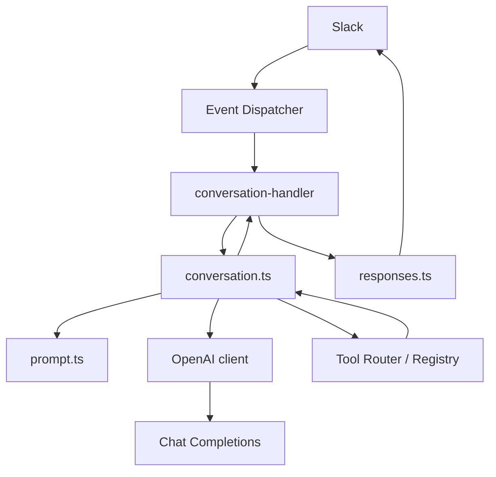

# AI Conversation Architecture

### Overview

Conversation layer between Slack handlers and Slack responses. Supports plain-text replies and a vendor-agnostic **tool loop** (demonstration tools only). Business APIs are not called.

### Diagram

### Modules

| Path | Role |
|------|------|
| `src/lib/ai/client.ts` | Config, singleton client, tools adapter, retries, timeouts |
| `src/lib/ai/conversation.ts` | Orchestration + tool loop + validation + fallback |
| `src/lib/ai/prompt.ts` | System/user message builder |
| `src/lib/ai/errors.ts` | Typed errors + friendly fallback text |
| `src/lib/tools/*` | Tool foundation (see tools feature area) |
| `src/lib/slack/conversation/conversation-handler.ts` | Slack adapter |

### Configuration

| Env | Default |
|-----|---------|
| `OPENAI_API_KEY` | required when AI enabled |
| `OPENAI_MODEL` | `gpt-4o-mini` |
| `OPENAI_MAX_TOKENS` | `512` |
| `OPENAI_TEMPERATURE` | `0.7` |
| `OPENAI_TIMEOUT_MS` | `30000` |
| `OPENAI_BASE_URL` | `https://api.openai.com/v1` |
| `AI_API_KEY` / `AI_MODEL` / `AI_BASE_URL` | aliases |
