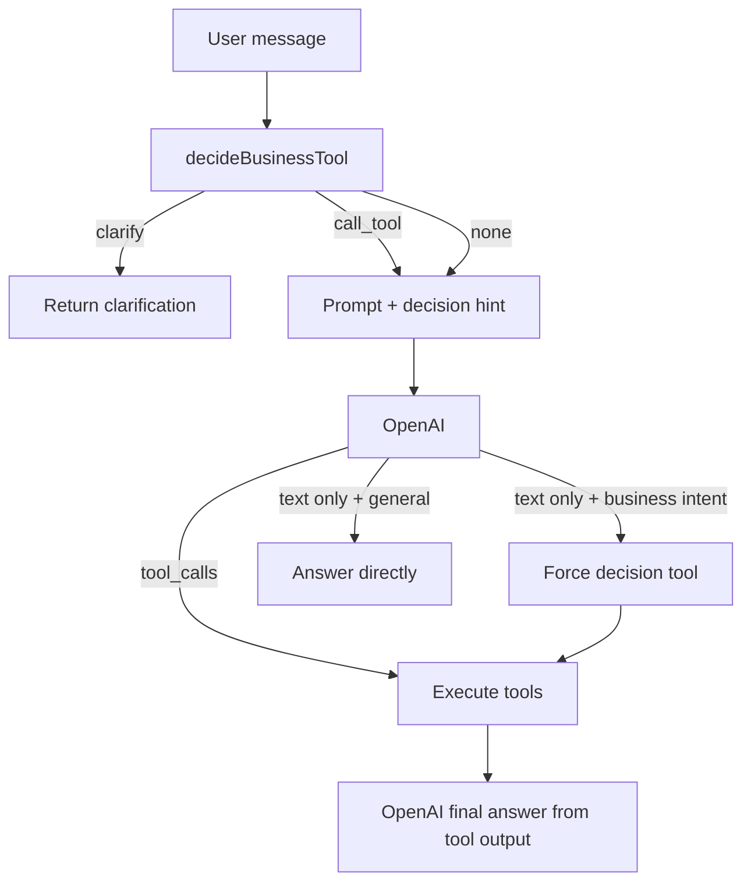

# AI Decision Engine

### Overview

Deterministic router that maps user intent to Business Tools before (and if needed instead of) trusting the model to call tools.

### Business Purpose

Business data must never come from model knowledge. The decision engine makes tool selection reliable for work context and timesheet reads.

### Workflow

### Business Logic

| Intent | Tool |
|--------|------|
| project / client / role / work context | `get_work_context` |
| today / yesterday / weekday / ISO date | `get_timesheet` |
| week / month / summary range | `get_timesheet_range` |
| ambiguous bare day (e.g. วันที่ 15) | clarify — no LLM |
| thanks / greeting / joke / story | no tool |

Timezone for resolved dates: `Asia/Bangkok`.

If the model returns a text answer on round 0 for a `call_tool` decision, Conversation Service injects the decision tool call and executes it.

### Code

- `src/lib/ai/decision-engine.ts`
- `src/lib/ai/conversation.ts`
- `src/lib/ai/prompt.ts`
