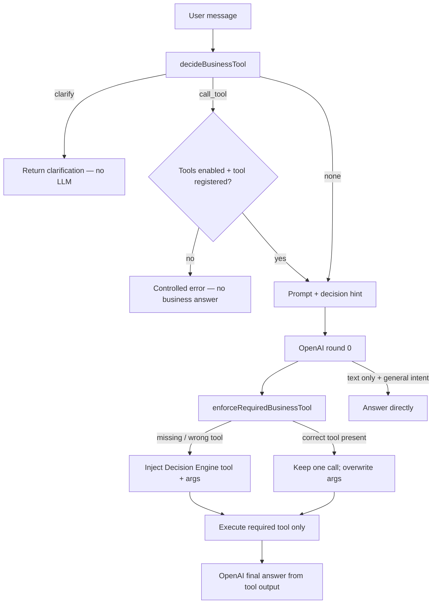

# AI Decision Engine

### Overview

Deterministic router that maps user intent to Business Tools before (and if needed instead of) trusting the model to call tools.

### Business Purpose

Business data must never come from model knowledge. The decision engine makes tool selection reliable for work context and timesheet reads. Conversation Service enforces that the **exact** required Business Tool runs on round 0.

### Workflow

### Explicit date ranges

Detected **before** single-date routing. Patterns include:

- `จาก 2026-07-01 ถึง 2026-07-10`
- `ตั้งแต่ 2026-07-01 ถึง 2026-07-10`
- `from 2026-07-01 to 2026-07-10`
- `between 2026-07-01 and 2026-07-10`
- `2026-07-01 - 2026-07-10`

Rules:

- Both dates must be real calendar days
- `startDate > endDate` → clarify (no LLM / no tool)
- Range longer than 31 inclusive days → clarify
- Never silently collapse an explicit range into `get_timesheet`

### Business Logic

| Intent | Tool / outcome |
|--------|----------------|
| project / client / role / work context | `get_work_context` |
| today / yesterday / tomorrow / weekday / one ISO date | `get_timesheet` (Bangkok calendar) |
| explicit ISO range | `get_timesheet_range` |
| week / month / summary phrases | `get_timesheet_range` |
| ambiguous bare day (e.g. วันที่ 15) | clarify — no LLM |
| unresolved day-ish phrase | clarify — never guess today |
| thanks / greeting / joke / story | no tool |

Timezone: `Asia/Bangkok` (`bangkokToday` / `bangkokYesterday` / `bangkokTomorrow`).

### Round-0 required-tool enforcement

When the Decision Engine returns `call_tool`:

1. Inspect model tool calls on round 0.
2. An unrelated tool (`ping`, `current_date`, wrong Business Tool, etc.) does **not** satisfy the gate.
3. If the required tool is absent, inject the Decision Engine call (name + arguments).
4. If the required tool is present, keep a single call and overwrite arguments with Decision Engine values (no duplicate execution).
5. Do not execute demonstration tools as a substitute.
6. If the required tool is missing from the registry → controlled configuration error (no LLM business answer).
7. If `enableTools: false` with business intent → controlled tools-disabled error (no LLM business answer).

Tests prove these paths with a model that skips tools or selects the wrong tool on purpose.

### Code

- `src/lib/ai/decision-engine.ts`
- `src/lib/ai/conversation.ts` (`enforceRequiredBusinessTool`)
- `src/lib/ai/prompt.ts`
- `src/lib/tools/business/timesheet/bangkok-dates.ts`
