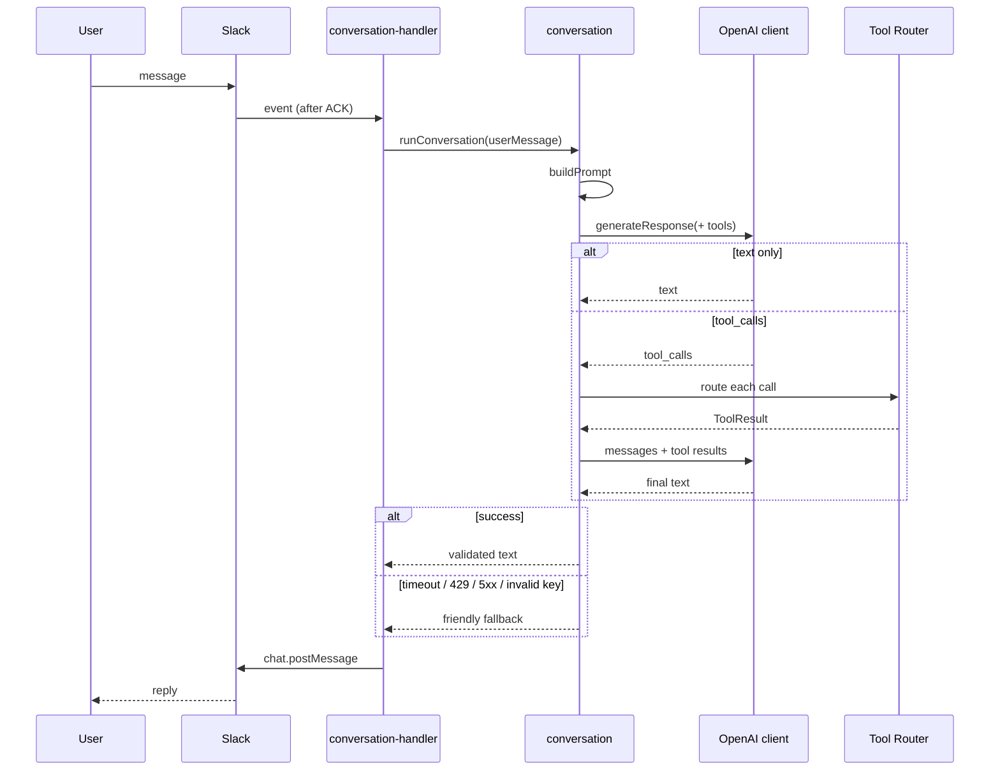

# AI Request Lifecycle

### Sequence

### Retry strategy

Transient failures (`timeout`, `rate_limited`, `server_error`, `network`): up to `maxRetries` (default 2) with exponential backoff starting at 250ms.

Non-retryable: `invalid_api_key`, `invalid_config`, most 4xx.

Tool rounds: max 3 per user turn (`MAX_TOOL_ROUNDS`).

### Error handling

| Failure | User-visible |
|---------|----------------|
| Empty / oversized / OpenAI error | Friendly fallback (no raw SDK text) |
| Unknown / failed tool | Result JSON fed back to model; model answers from that |
| Slack send failure | Logged; Event already ACKed |

### Logging

`conversation started` → `OpenAI request` → (tool lifecycle logs) → `OpenAI response` / failure → `conversation completed`  
Fields: `requestId`, `eventId`, `durationMs`, `model`, `toolRounds`, token usage. Never API keys.
