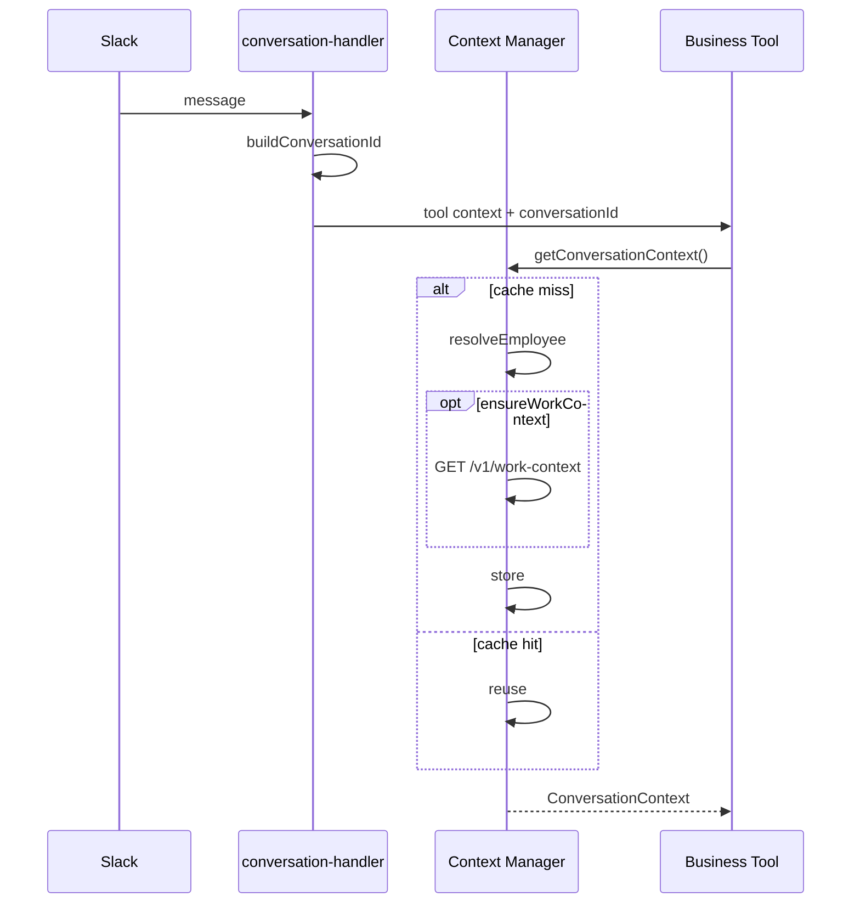

# Conversation Context

## Purpose

Ephemeral per-conversation cache for identity, work context, and Client/Project/Role selection.

Never persisted to Redis/DB. TTL default: 30 minutes (in-process).

## Lifecycle



## Shape

```ts
interface ConversationContext {
  conversationId: string;
  slackUserId: string;
  slackEmail: string;
  employeeId: string;
  employeeName?: string;
  /** Zoho StaffProfile fields for Time Log denormalized columns (Slack writes) */
  firstName?: string;
  lastName?: string;
  position?: string;
  workContext?: WorkContext;
  selectedClient?: { id: string; name: string };
  selectedProject?: { id: string; name: string };
  selectedRole?: { id: string; name: string };
  loadedAt: Date;
}
```

Identity resolution stores `firstName` / `lastName` / `position` from Zoho People when Conversation Context is first created. Confirm writes pass these into `agentAuthFromConversationIdentity` so Google Sheets Time Log columns **Staff First Name**, **Staff Last Name**, and **Staff Position** match the Weekly Timesheet UI path.
## Smart loading

| Option | Behavior |
|--------|----------|
| (default) | Resolve identity if missing; do not load work context |
| `ensureWorkContext: true` | Load work context once if missing |
| `forceRefreshWorkContext: true` | Reload work context; clear selections |

## Invalidation

| Event | Clears |
|-------|--------|
| `selectClient` | selectedProject, selectedRole |
| `selectProject` | selectedRole |
| `forceRefreshWorkContext` | all selections + reloads workContext |

## Security

- Business tools never accept `employeeId` from AI input
- Business tools never call Slack/Zoho identity APIs directly
- Conversation ids include Slack user to isolate concurrent conversations
- Mismatched slackUserId on a cached conversation id forces re-resolve

## Source Code References

- `src/lib/conversation/context/`
- `src/lib/slack/conversation/conversation-handler.ts`
