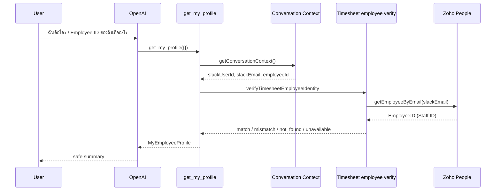

# Get My Profile

## Tool

`get_my_profile`

## Purpose

Let the current Slack user verify which employee identity the Timesheet AI Agent resolved, and whether that identity matches the identifier used by the Weekly Timesheet data source (Google Sheets Time Log **Staff ID** = Zoho **EmployeeID**).

## Input

```ts
{} // empty object only
```

```json
{
  "type": "object",
  "properties": {},
  "additionalProperties": false
}
```

Reject any AI-supplied identity fields (`employeeId`, `email`, `slackUserId`, `zohoRecordId`, …) with `validation_error`.

## Identity source



Conversation Context remains the only employee identity source for Business Tools. This tool does **not** update Conversation Context or change mappings.

## Timesheet employee identifier

| Layer | Identifier |
|-------|------------|
| Conversation Context | Zoho `EmployeeID` (e.g. `S0005`) |
| Weekly Timesheet UI session | `staffProfile.EmployeeID` |
| Google Sheets Time Log | column **Staff ID** = same Zoho `EmployeeID` |
| Diagnostic type | `zoho_EmployeeID` |

Verification reuses Zoho `getEmployeeByEmail` (same path as NextAuth / Slack identity). It does **not** invent `/v1/me`, does not scan Time Log entries for a date, and does not treat zero hours as identity failure.

## Safe response (`MyEmployeeProfile`)

| Field | Meaning |
|-------|---------|
| `slackUserId` | From Conversation Context |
| `slackEmail` | From Conversation Context |
| `employeeId` | From Conversation Context |
| `employeeName` | Safe display name from Zoho verification (optional) |
| `timesheetIdentityType` | e.g. `zoho_EmployeeID` |
| `timesheetIdentityValue` | Identifier used as Time Log Staff ID |
| `timesheetIdentityMatched` | boolean |
| `timesheetIdentityStatus` | `matched` \| `not_found` \| `mismatch` \| `unavailable` |
| `diagnosticMessage` | Safe explanation |

Never returned: tokens, API keys, raw Zoho payloads, salary, bank, address, phone, national ID, birth date, other employees.

## Status meanings

| Status | Meaning |
|--------|---------|
| `matched` | Context `employeeId` equals Timesheet Staff ID (Zoho EmployeeID) |
| `mismatch` | Lookup succeeded but identifier differs |
| `not_found` | No employee record for context email (mapping issue — not “no entries”) |
| `unavailable` | Lookup timed out / service error (not a mismatch claim) |

## Natural-language examples

| User | Tool |
|------|------|
| ฉันคือใคร | `get_my_profile({})` |
| Employee ID ของฉันคืออะไร | `get_my_profile({})` |
| ตรวจสอบ Timesheet identity ของฉัน | `get_my_profile({})` |
| Who am I? | `get_my_profile({})` |
| What is an employee ID? | no tool (general concept) |

## Security

- No AI identity arguments
- No cross-employee lookup
- Read-only / idempotent
- Structured logs: requestId, conversationId, verification status, identity type — never secrets

## Code

- `src/lib/tools/business/profile/get-my-profile.ts`
- `src/lib/timesheet/employee-identity.ts`
