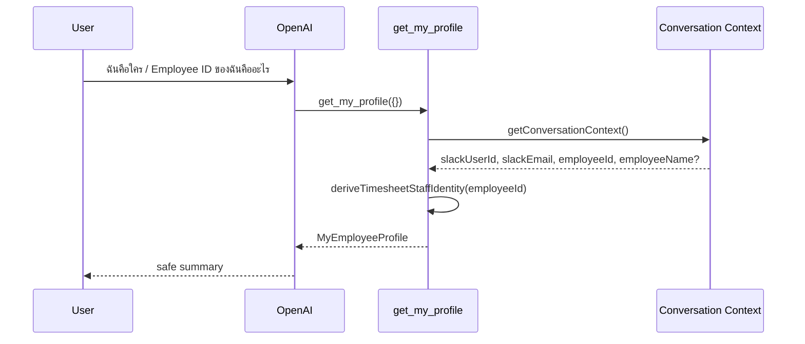

# Get My Profile

## Tool

`get_my_profile`

## Purpose

Show the current Slack user which employee identity Conversation Context holds, and which Google Sheets Time Log **Staff ID** the canonical Timesheet reader will use.

## Input

```ts
{} // empty object only
```

Reject AI-supplied identity fields (`employeeId`, `email`, `slackUserId`, `zohoRecordId`, `staffId`, `timesheetStaffId`, …) with `validation_error` — without calling Context Manager.

## Flow



**No Zoho lookup. No Slack lookup. No Sheets lookup inside this tool.**

Identity resolution (Slack → email → Zoho) happens only when Conversation Context is first created — outside Business Tools.

## Canonical Staff ID

| Field | Value |
|-------|-------|
| `identitySource` | `conversation_context` |
| `timesheetIdentityType` | `zoho_EmployeeID` |
| `timesheetStaffId` | Conversation Context `employeeId` |
| Canonical reader | `AgentAuthContext.staff.EmployeeID` = same value |
| Sheets filter | Time Log `Staff ID` === that value |

## Response (`MyEmployeeProfile`)

| Field | Meaning |
|-------|---------|
| `slackUserId` / `slackEmail` / `employeeId` | From Conversation Context |
| `employeeName` | From Conversation Context if stored at identity creation |
| `identitySource` | Always `conversation_context` |
| `timesheetIdentityType` | `zoho_EmployeeID` |
| `timesheetStaffId` | Present when configured |
| `timesheetMappingStatus` | `configured` \| `missing` |
| `diagnosticMessage` | Safe explanation |

### Status meanings

| Status | Meaning |
|--------|---------|
| `configured` | Context has an employeeId; the canonical reader will filter Time Log by that Staff ID. **Not** an independent Timesheet employee-master verification. |
| `missing` | Context lacks the employeeId required for the Staff ID filter. |

There is **no** independent Timesheet employee master in this app. Do not use `matched` / `mismatch` / `timesheetIdentityMatched` for this tool.

## Security

- Empty args only; no AI identity override
- No cross-employee query
- Read-only / idempotent
- Safe logs: requestId, conversationId, mappingStatus, identity type — not tokens or raw Zoho payloads

## Code

- `src/lib/tools/business/profile/get-my-profile.ts`
- `src/lib/timesheet/timesheet-staff-identity.ts` (pure helper)
