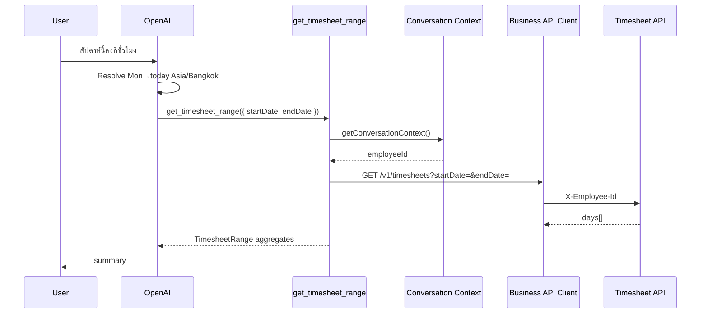

# Get Timesheet Range

## Tool

`get_timesheet_range`

## Purpose

Answer questions spanning **multiple calendar days** (this week, last week, this/last month, custom ranges) after the AI resolves bounds to inclusive `YYYY-MM-DD` dates in `Asia/Bangkok`.

## Input

```ts
{ startDate: string; endDate: string } // both required, YYYY-MM-DD
```

Rules:

- `startDate` must not be after `endDate`
- Maximum **31** inclusive calendar days
- Do **not** accept `employeeId` or relative date words

## Flow



## API

```http
GET /v1/timesheets?startDate=2026-07-13&endDate=2026-07-19
X-Employee-Id: <from Conversation Context>
```

Dates are inclusive.

## Response (`TimesheetRange`)

| Field | Meaning |
|-------|---------|
| `startDate` / `endDate` | Inclusive range |
| `days` | `DailyTimesheet[]` |
| `totalHours` | Aggregate hours |
| `expectedHours` | Aggregate expected |
| `remainingHours` | Aggregate remaining |
| `submittedDays` / `unsubmittedDays` | Submission counts |

Enables answers about work in range, totals by date, missing/incomplete days, and submission status.

## Natural-language examples

| User | Tool call (example for 2026-07-19 Bangkok) |
|------|---------------------------------------------|
| สัปดาห์นี้ | `startDate: 2026-07-13`, `endDate: 2026-07-19` |
| สัปดาห์ที่แล้ว | previous Mon–Sun |
| เดือนนี้ | first of month → today |
| เดือนที่แล้ว | first → last of previous month |
| custom ISO range | pass explicit start/end |

## Compatibility

`get_week_timesheet` is a **deprecated** wrapper (not AI-registered) that calls this shared range load for Bangkok current week (Monday → today) and maps to the legacy week shape.

## Code

- `src/lib/tools/business/timesheet/get-timesheet-range.ts`
- `src/lib/tools/business/timesheet/parse-timesheet-range.ts`
- `src/lib/tools/business/timesheet/bangkok-dates.ts`
