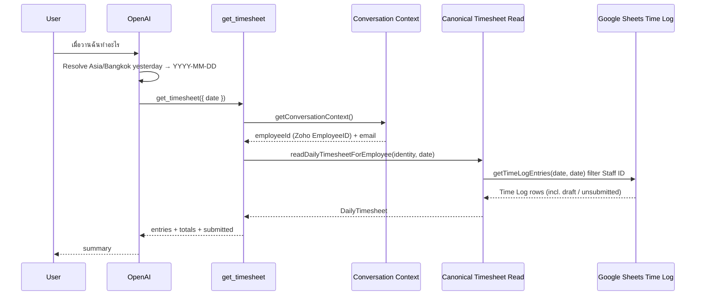

# Get Timesheet

## Tool

`get_timesheet`

## Purpose

Answer natural-language questions about **one calendar day** of timesheet data (today, yesterday, a named weekday, or an explicit date) after the AI resolves the date to `YYYY-MM-DD` in `Asia/Bangkok`.

Reads the **same persisted Google Sheets Time Log** as the Weekly Timesheet UI via the canonical Timesheet read service.

## Input

```ts
{ date: string } // required, YYYY-MM-DD only
```

- Do **not** accept `employeeId`.
- Do **not** accept relative words (`today`, `yesterday`, Thai equivalents, etc.).
- The AI layer must resolve relatives before calling.

## Flow



## Data source (canonical)

There is **no** `GET /v1/timesheets` route in this app.

| Layer | Contract |
|-------|----------|
| Weekly Timesheet UI | `GET /api/timesheet/get?weekStart=` → `getWeeklyTimesheetForStaff` |
| Shared row load | `getTimeLogRowsForStaffRange` → Google Sheets **Time Log** |
| AI tools | `readDailyTimesheetForEmployee` → same shared row load |

Identity filter: Zoho **`EmployeeID`** matched to Sheets **`Staff ID`**.

Draft/unsubmitted rows in the Time Log are readable. `submitted: false` must not drop entries.

## Response (`DailyTimesheet`)

| Field | Meaning |
|-------|---------|
| `date` | ISO date |
| `entries` | Work logged that day (`clientName`, `projectName` = `Project Name (Project Code)` when both exist, `taskName`←Sheets Task, `taskId`←Task ID, `hours`). Deprecated aliases: `roleName`/`roleId` mirror Task for compatibility — AI must present Task as work/task, never “บทบาท”. |
| `totalHours` | Sum of entry hours |
| `expectedHours` | Default 8 |
| `remainingHours` | Expected minus total |
| `submitted` | Sheets has no week-submit flag on rows; currently `false` for persisted drafts |

Empty successful day (`entries=[]`, `totalHours=0`) means no work logged — not an integration failure.

## Errors (must not be phrased as “no data”)

| Condition | Tool error code |
|-----------|-----------------|
| Missing employee mapping | `identity_mapping` |
| Sheets / network failure | `integration` / `upstream` |
| Timeout | `timeout` |
| Auth failure from Sheets | `authentication` |
| Invalid date | `validation` |

## Natural-language examples

| User | Tool call |
|------|-----------|
| วันนี้ฉันทำอะไร | `get_timesheet({ date: <Bangkok today> })` |
| เมื่อวานฉันทำอะไร | `get_timesheet({ date: <Bangkok yesterday> })` |
| 2026-07-15 ฉันลงอะไร | `get_timesheet({ date: "2026-07-15" })` |

Ambiguous phrases like “วันที่ 15” without month/year → ask clarification; do not guess.

## Identity

Employee ID comes only from Conversation Context. Tools never resolve Slack/Zoho themselves.

## Compatibility

`get_today_timesheet` is a **deprecated** wrapper (not AI-registered) that calls this shared daily load with Bangkok today.

## Code

- `src/lib/timesheet/canonical-read.ts`
- `src/lib/timesheet/timesheet-service.ts` (`getTimeLogRowsForStaffRange`)
- `src/lib/tools/business/timesheet/get-timesheet.ts`
- `src/lib/tools/business/timesheet/parse-timesheet.ts`
- `src/lib/tools/business/timesheet/date-input.ts`
