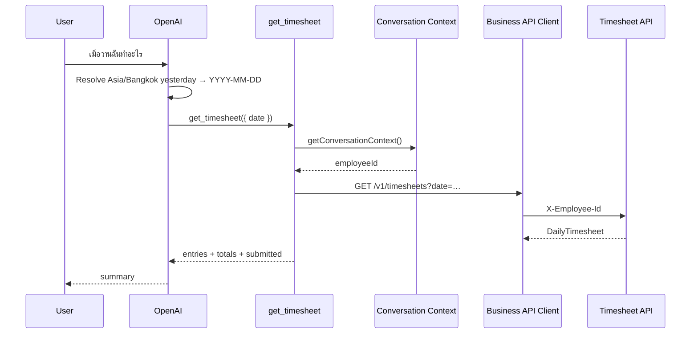

# Get Timesheet

## Tool

`get_timesheet`

## Purpose

Answer natural-language questions about **one calendar day** of timesheet data (today, yesterday, a named weekday, or an explicit date) after the AI resolves the date to `YYYY-MM-DD` in `Asia/Bangkok`.

## Input

```ts
{ date: string } // required, YYYY-MM-DD only
```

- Do **not** accept `employeeId`.
- Do **not** accept relative words (`today`, `yesterday`, Thai equivalents, etc.).
- The AI layer must resolve relatives before calling.

## Flow



## API

```http
GET /v1/timesheets?date=2026-07-17
X-Employee-Id: <from Conversation Context>
```

## Response (`DailyTimesheet`)

| Field | Meaning |
|-------|---------|
| `date` | ISO date |
| `entries` | Work logged that day |
| `totalHours` | Sum of entry hours |
| `expectedHours` | Default 8 if omitted |
| `remainingHours` | Expected minus total (or upstream) |
| `submitted` | Day submission flag |

## Natural-language examples

| User | Tool call |
|------|-----------|
| วันนี้ฉันทำอะไร | `get_timesheet({ date: <Bangkok today> })` |
| เมื่อวานฉันทำอะไร | `get_timesheet({ date: <Bangkok yesterday> })` |
| 2026-07-15 ฉันลงอะไร | `get_timesheet({ date: "2026-07-15" })` |

Ambiguous phrases like “วันที่ 15” without month/year → ask clarification; do not guess.

## Identity

Employee ID comes only from Conversation Context. Tools never resolve Slack/Zoho themselves.

## Compatibility

`get_today_timesheet` is a **deprecated** wrapper (not AI-registered) that calls this shared daily load with Bangkok today.

## Code

- `src/lib/tools/business/timesheet/get-timesheet.ts`
- `src/lib/tools/business/timesheet/parse-timesheet.ts`
- `src/lib/tools/business/timesheet/date-input.ts`
