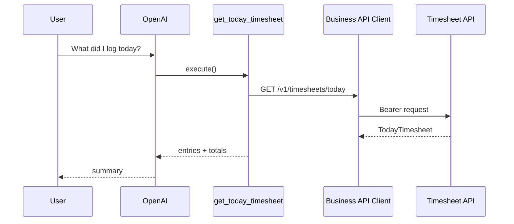

# Get Today Timesheet

## Tool

`get_today_timesheet`

## Purpose

Answer “What did I log today?” with entries, totals, remaining hours, and submitted status.

## Flow

## Return fields

| Field | Meaning |
|-------|---------|
| `date` | ISO date |
| `entries` | List of day entries |
| `totalHours` | Sum of entry hours |
| `remainingHours` | `expectedHours - totalHours` (or upstream value) |
| `expectedHours` | Default 8 if omitted |
| `submitted` | Day submission flag |

## API

| Method | Path |
|--------|------|
| GET | `/v1/timesheets/today` |

## Error cases

Auth / timeout / upstream / malformed → typed `errorCode` on ToolResult (`authentication`, `timeout`, `unexpected`, `validation_error`).

## Source Code References

- `src/lib/tools/business/timesheet/get-today-timesheet.ts`
