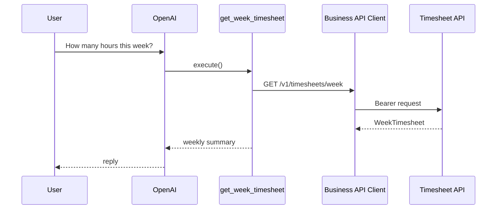

# Get Week Timesheet

## Tool

`get_week_timesheet`

## Purpose

Return the current week summary: week range, daily totals, weekly total, submission status.

## Flow

## Return fields

| Field | Meaning |
|-------|---------|
| `weekStart` | Week start date |
| `weekEnd` | Optional week end |
| `days` | `{ date, totalHours, submitted? }[]` |
| `weeklyTotal` | Sum of daily totals (or upstream) |
| `submitted` | Week-level submitted flag |
| `submissionStatus` | Optional status string |

## API

| Method | Path |
|--------|------|
| GET | `/v1/timesheets/week` |

## Error cases

Auth / timeout / upstream / malformed → typed ToolResult errors.

## Source Code References

- `src/lib/tools/business/timesheet/get-week-timesheet.ts`
