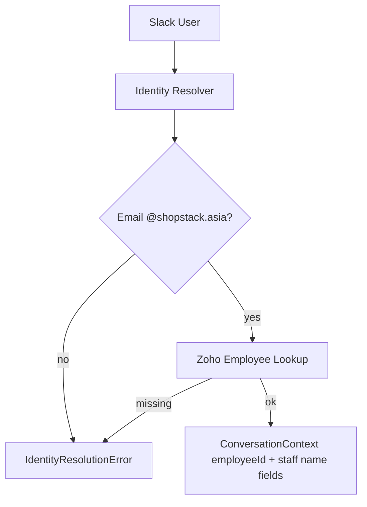

# Identity Resolution

## Purpose

Bind a Slack user to a Shopstack Zoho Employee ID before any Business Tool runs.

## Flow

```text
Slack User ID
  → Slack users.info (email)
  → @shopstack.asia domain gate
  → Zoho People getEmployeeByEmail
  → Employee ID + FirstName + LastName + Position
  → Conversation Context
```



## API

```ts
resolveEmployee(slackUserId): Promise<ResolvedIdentity>
```

Implemented in `createIdentityResolver()`; default uses `resolveSlackIdentity`.

`ResolvedIdentity` includes optional `firstName`, `lastName`, `position` from Zoho StaffProfile (in addition to `employeeId` / `employeeName`). These are stored on Conversation Context and used when Slack confirm writes Time Log denormalized staff columns.

## Rules

- Business tools MUST NOT resolve identity themselves
- Business tools MUST NOT accept employeeId from AI
- Downstream Timesheet API calls receive `X-Employee-Id` from Conversation Context only
- Time Log writes MUST use staff name/position from Conversation Context (not AI input)
## Failure cases

| Case | Result |
|------|--------|
| Missing Slack email / bot user | IdentityResolutionError |
| Non-@shopstack.asia | IdentityResolutionError |
| Zoho miss | IdentityResolutionError |

## Source Code References

- `src/lib/conversation/context/identity-resolver.ts`
- `src/lib/slack/identity.ts`
