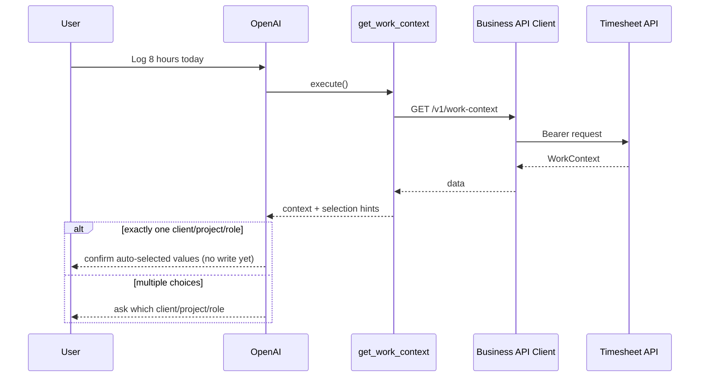

# Work Context

## Tool

`get_work_context`

## Purpose

Return everything required for future Timesheet creation in **one** tool call.

## Architecture

```text
Slack → Conversation → OpenAI → Tool Router → get_work_context
  → Business API Client → GET /v1/work-context → Timesheet API
```



## Response shape

```ts
interface WorkContext {
  user: { id: string; name: string };
  clients: Client[];
}

interface Client {
  id: string;
  name: string;
  projects: Project[];
}

interface Project {
  id: string;
  name: string;
  roles: Role[];
}

interface Role {
  id: string;
  name: string;
}
```

Tool result also includes `selection` hints (`autoSelectable`, message).

## Business rules

- Auto-select only when exactly one Client, Project, and Role
- Otherwise ask the user — never guess
- Conversation memory only (no permanent store)
- Do not create timesheet in this phase

## API

| Method | Path |
|--------|------|
| GET | `/v1/work-context` |

## Error cases

| Case | Tool `errorCode` |
|------|------------------|
| Auth failure | `authentication` |
| Timeout | `timeout` |
| Upstream 5xx | `unexpected` |
| Malformed body | `validation_error` |

## Source Code References

- `src/lib/tools/business/context/get-work-context.ts`
