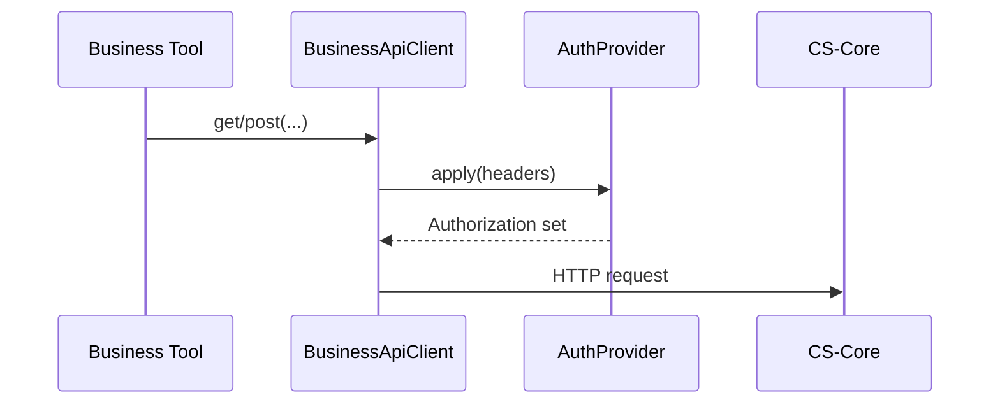

# Authentication

## Rule

Business Tools must **never** manually create auth headers. The client applies an `AuthProvider` on every request.

## Current: Bearer Token

```text
BUSINESS_API_KEY
  → createBearerTokenProvider(apiKey)
  → Authorization: Bearer <token>
```

Default when creating the client without an injected provider.

## API Key provider

```ts
createApiKeyProvider(apiKey, 'X-API-Key')
```

Ready for gateways that prefer a dedicated header.

## Future

| Provider | Status |
|----------|--------|
| OAuth | Stub — throws until implemented |
| JWT | Stub — throws until implemented |

## Flow



## Source Code References

- `src/lib/business/auth.ts`
- `src/lib/business/client.ts`
