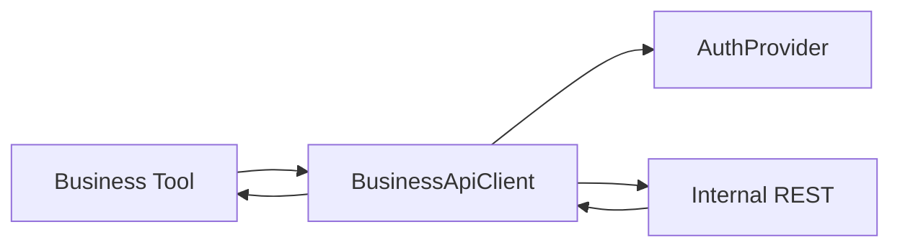

# Business API Foundation

## Purpose

Provide a reusable HTTP client so future AI Business Tools can call CS-Core (and other internal REST APIs) without embedding transport, auth, or retry logic.

## Target flow

```text
Slack → Conversation → Tool Router → Business Tool
  → Business API Client → CS-Core REST → Business Response
  → OpenAI → Slack
```

Business Tools must use `createBusinessApiClient()` only — never `fetch()`.

## Architecture



## Modules

| Module | Role |
|--------|------|
| `config.ts` | Env load + startup assert |
| `auth.ts` | Bearer / API Key / future OAuth+JWT |
| `client.ts` | GET/POST/PUT/PATCH/DELETE |
| `errors.ts` | Typed error mapping |
| `logger.ts` | Secret-safe structured logs |
| `types.ts` | `ApiResponse<T>`, request options |

## Future APIs (no client changes)

Timesheet, Leave, Holiday, Employee, Project, Approval — each becomes a thin tool that calls `client.get/post/...` with paths.

## Security

- Secrets only in env / AuthProvider
- Logs never include Authorization or API keys
- Server-side only (`src/lib/business`)
- Automatic retries require **idempotent** requests (POST/PATCH never retry by default)

## Safe retry (create/update readiness)

- `idempotent` + optional `idempotencyKey` on `BusinessRequestOptions`
- Prevents duplicate `POST /timesheets` after timeout
- See [Request Lifecycle.md](./Request%20Lifecycle.md)

## Source Code References

- `src/lib/business/`
- `.env.example` — `BUSINESS_API_*`
