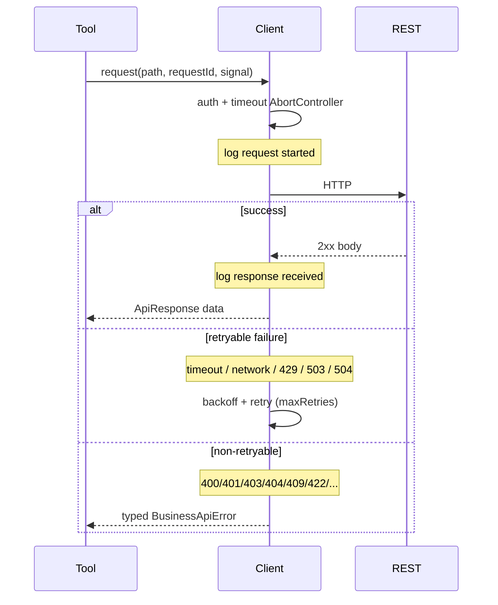

# Request Lifecycle

## Sequence



## Options on every request

| Field | Purpose |
|-------|---------|
| `requestId` | Correlation (auto-generated if omitted) |
| `signal` | Cooperative cancel from Tool Executor |

## Timeout

Per-request `AbortController` with `BUSINESS_API_TIMEOUT_MS`. Timeout aborts the in-flight fetch and maps to `TimeoutError` (retryable).

## Retry policy

**Retry:** timeout, network, HTTP 429, 503, 504  

**Do not retry:** 400, 401, 403, 404, 409, 422 (and other non-listed client errors)

Backoff: `250 * 2^attempt` ms.

## Logging

```text
request started → response received
              ↘ request failed
```

Fields: `requestId`, `method`, `endpoint`, `status`, `duration`, `attempt`. Never Authorization / API keys / tokens.

## Response shape

```ts
interface ApiResponse<T> {
  success: true;
  data: T;
  status: number;
  requestId: string;
}
```

Supports raw JSON payloads or `{ data: T }` envelopes.

## Source Code References

- `src/lib/business/client.ts`
- `src/lib/business/logger.ts`
