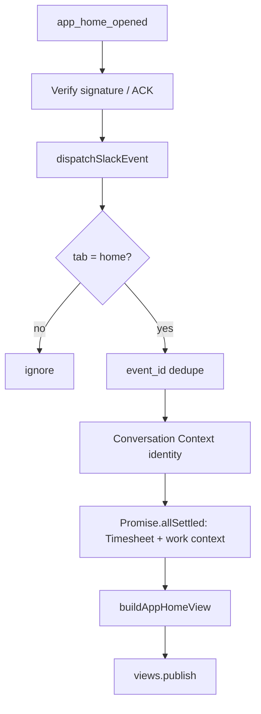

# Slack App Home

### Overview

Deterministic, read-only Slack **Home** tab dashboard for AI Timesheet. When a user opens the app Home tab, the bot publishes a personalized Block Kit view with current-week Timesheet summary, daily hours, assigned projects, command examples, and safe navigation actions.

App Home does **not** use OpenAI, Intent Extraction, Business Tool routing, or Timesheet writes.

### Business Purpose

Replace Slack’s default “work in progress” Home placeholder with a useful employee dashboard while keeping Messages as the natural-language read/write surface.

### User Roles and Permissions

| Role | Access | Actions |
|------|--------|---------|
| Linked Slack employee (`@shopstack.asia` → Zoho) | Own Home dashboard | Open Home, Refresh, Help, open Weekly Timesheet URL |
| Unlinked Slack user | Identity error view only | Retry |
| Another employee | Cannot see peer data | Isolated by Conversation Context / `slack:app_home:{userId}` |

### Workflow

1. Slack delivers `app_home_opened` to `POST /api/slack/events` (existing verify + rate limit + `waitUntil`).
2. `dispatchSlackEvent` routes `app_home_opened` to `handleAppHomeOpened` (before message ignore rules).
3. Non-`home` tabs are ignored. Duplicate `event_id` is deduped via existing Redis `wasEventProcessed`.
4. Trusted `event.user` → Conversation Context (`slack:app_home:{slackUserId}`) → employee identity.
5. Concurrent canonical Timesheet week read + work-context load.
6. Pure Block Kit builder → `views.publish` (optional loading view if slow).
7. Block Kit actions (`app_home_refresh`, `app_home_help`, `app_home_retry`) handled on `POST /api/slack/interactions` without OpenAI/writes.

### Use Cases

- Open Home → see week summary and projects
- Refresh → reload dashboard
- Help → deterministic modal (or expanded Home fallback)
- Open Weekly Timesheet → HTTPS URL button (no identity in URL)
- Identity / dependency failures → controlled Thai error copy

### Screen Behavior

| State | Behavior |
|-------|----------|
| Loading (optional) | “กำลังโหลดข้อมูล Timesheet ของคุณ…” then exactly one final publish |
| Complete | Greeting, week total, Mon–Sun hours, projects (≤5), commands, actions |
| Empty Timesheet | “สัปดาห์นี้ยังไม่มีรายการลงเวลา” (not access denial) |
| Partial | Timesheet or projects error notice; other section still shown |
| Identity error | Controlled link-failure copy + ลองใหม่ |
| Dependency error | Both business sections failed |

### Business Logic

- Asia/Bangkok Monday–Sunday week via `weekRangeContaining`
- Totals from canonical Sheets Time Log range only — **no invented expected hours**
- Zero-hour days shown as “0 ชั่วโมง” (neutral)
- Projects: dedupe by id, sort client/name, max 5 + “และอีก N โปรเจกต์”
- Display name from Conversation Context; never show Employee/Staff ID on default Home

### Validation Rules

- Button values: only `refresh` | `help` | `retry`
- No `private_metadata` with identity/business data
- Timesheet URL: configured app origin + `/timesheet`, HTTPS in production, no query/hash

### Edge Cases

- Duplicate Slack event / action delivery → dedupe, at most one publish
- `views.publish` failure → logged; no unhandled route crash
- Work-context failure does not hide Timesheet (and vice versa)

### API and Integration Behavior

| Integration | Usage |
|-------------|--------|
| Conversation Context Manager | Identity + optional work context |
| `readTimesheetRangeForEmployee` | Canonical week hours |
| Business API work-context | Assigned clients/projects |
| Slack `views.publish` / `views.open` | Home + help modal |
| Redis event dedupe | `wasEventProcessed` |

### Security and Authorization

- Conversation Context is the **only** employee identity source
- Forged `employeeId` / Staff ID / email / slackUserId on action payloads are ignored
- **Workspace isolation:** when `SLACK_ALLOWED_WORKSPACE` is set, App Home processes only that exact Slack Team ID
  - Events: `envelope.team_id`
  - Actions: `payload.team.id`
  - Missing or mismatched workspace → fail closed (no identity, no reads, no `views.publish` / `views.open`)
  - Validly signed but rejected interactions still ACK **HTTP 200** (no Slack retry storm); invalid signatures remain **401**
- Conversation Context key is workspace-scoped: `slack:app_home:{workspaceId}:{userId}` (URI-encoded components). If no allow-list is configured and team id is missing: `slack:app_home:unscoped:{userId}`
- Do **not** put workspace or employee identity in Block Kit button values or `private_metadata`
- Production single-workspace deploys should set `SLACK_ALLOWED_WORKSPACE=TXXXXXXXX` (exact Team ID)
- No OpenAI on App Home path
- No prepare/confirm/cancel or Sheets writers from Home open/refresh

### Source Code References

- `src/lib/slack/app-home/*`
- `src/lib/slack/dispatcher.ts`
- `src/app/api/slack/interactions/route.ts`
- `src/lib/timesheet/canonical-read.ts`
- `src/lib/conversation/context/context-manager.ts`
- `src/lib/tools/business/timesheet/bangkok-dates.ts`

### Slack App configuration

1. Slack API → your app → **App Home**
2. Enable **Home Tab**
3. Keep **Messages Tab** enabled
4. **Event Subscriptions** → subscribe bot event `app_home_opened`
5. Confirm Request URL is the existing Events endpoint
6. Save changes
7. Reinstall only if OAuth scopes changed (App Home `views.publish` uses the existing bot token; no extra invent-on-scope required beyond current bot scopes)
8. Open AI Timesheet → **Home**

Existing bot scopes remain: `app_mentions:read`, `chat:write`, `im:history`, `im:read`, `im:write`, `users:read`, `users:read.email`.

### Production acceptance checklist

1. Open AI Timesheet → Home (placeholder gone)
2. Correct employee display name
3. Week dates Asia/Bangkok; totals match Weekly Timesheet page
4. Assigned projects correct
5. Refresh updates view
6. Weekly Timesheet button opens authenticated `/timesheet`
7. Help modal readable
8. Second employee sees only their data
9. Identity / partial errors show controlled copy
10. Opening/refreshing Home creates **zero** Timesheet writes
11. Logs show `scope: slack-app-home` with outcomes
12. Duplicate events do not double-publish

### Required tests

Covered in `src/lib/slack/app-home/app-home.test.ts` and `app-home-workspace.test.ts`: event routing, dedupe, identity isolation, Bangkok week boundaries, totals, projects cap, Block Kit safety, actions, no-write/no-OpenAI path, **workspace allow-list (events + interactions route + handler defense in depth)**, workspace-scoped Conversation Context keys.
