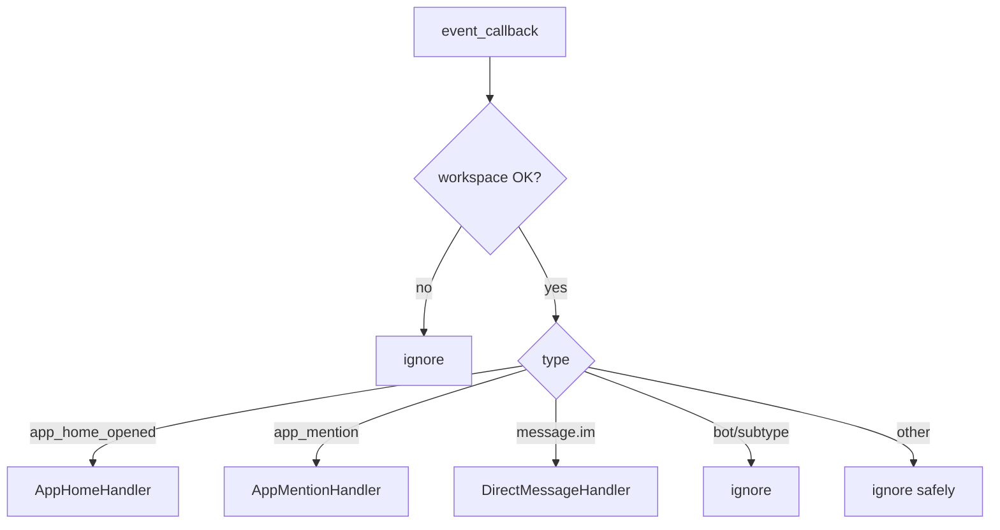

# Slack Event Dispatcher

### Overview

`dispatchSlackEvent` maps Slack `event_callback` envelopes to handlers. Unknown events are ignored safely while the HTTP layer still returns 200.

### Routing table

| Condition | Route |
|-----------|--------|
| `SLACK_ALLOWED_WORKSPACE` set and `team_id` differs | ignore (`workspace_mismatch`) |
| `event.type === app_home_opened` | `handleAppHomeOpened` (tab≠home ignored inside handler) |
| `event.bot_id` or `subtype=bot_message` (message path) | ignore (`bot`) |
| `event.type === app_mention` | `handleAppMention` |
| `event.type === message` and (`channel_type === im` or channel `D…`) | `handleDirectMessage` |
| Anything else | ignore (`ignored`) |

### Diagram

### Extensibility

- Add new `case` branches without changing `route.ts`
- Keep async `waitUntil(dispatch…)` so ACK timing stays stable

### Source Code References

- `src/lib/slack/dispatcher.ts`
- `src/lib/slack/app-home/handler.ts`
- `src/lib/slack/events/app-mention.ts`
- `src/lib/slack/events/direct-message.ts`
