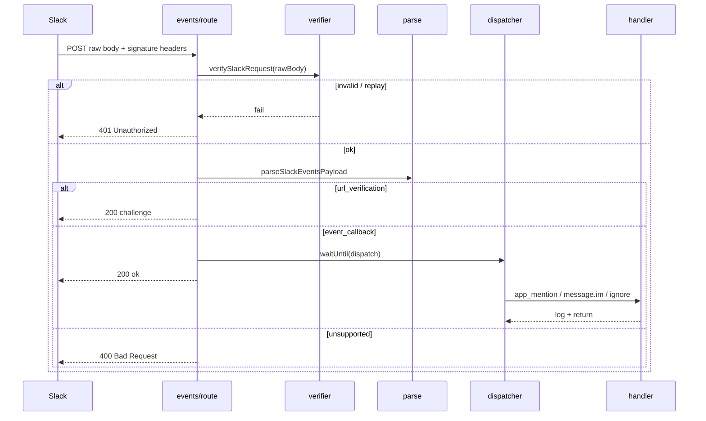

# Slack Event Lifecycle

### Overview

End-to-end lifecycle of a Slack Events API HTTP request against `/api/slack/events`.

### Lifecycle diagram

### Steps

1. **Receive** — Read raw body as text (required for HMAC).  
2. **Verify** — `x-slack-signature`, `x-slack-request-timestamp`, signing secret, replay window.  
3. **Rate limit** — Fail-closed Redis bucket `slack-events`.  
4. **Parse** — JSON → `url_verification` | `event_callback` | reject.  
5. **URL verification** — Return `{ challenge }` with HTTP 200 (Slack URL Validation).  
6. **Dispatch** — Async; extract `team_id`, `api_app_id`, `event_id`, `event_time`, `event`, `authorizations`.  
7. **ACK** — `{ ok: true }` before handler completion.  
8. **Handle** — Log event type, user, channel, text, timestamp, team.

### HTTP status map

| Condition | Status |
|-----------|--------|
| Invalid signature / replay / missing secret | 401 |
| Malformed JSON / unsupported type | 400 |
| URL verification / known or unknown event | 200 |
| Unexpected throw | 500 (no stack traces) |

### Source Code References

- `src/app/api/slack/events/route.ts`
- `src/lib/slack/events/index.ts`
- `src/lib/slack/verifier.ts`
