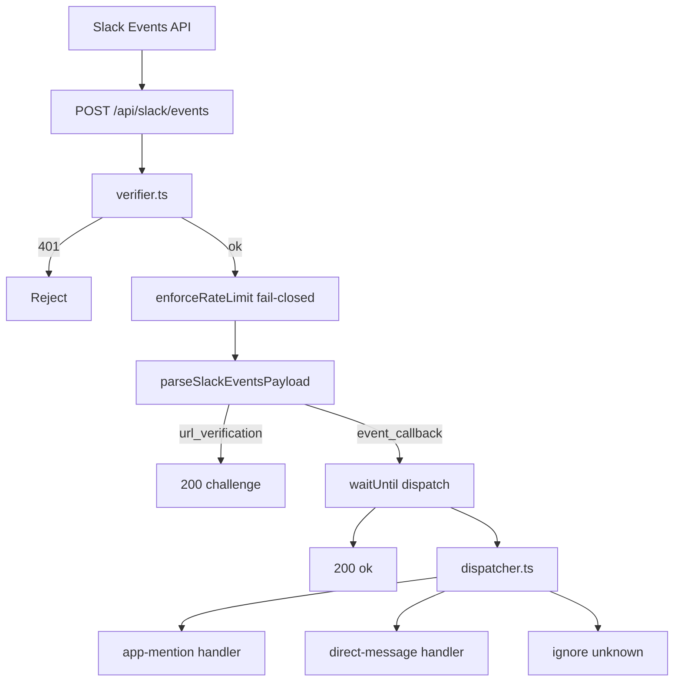

# Slack Events Architecture

### Overview

Production-ready Slack Events API gateway for AI Timesheet. This layer verifies Slack HTTP requests, acknowledges within Slack’s time budget, and dispatches typed events to foundation handlers. AI conversation is intentionally out of scope.

### Business Purpose

Provide a reusable, secure ingress so later phases can attach conversation / tools without rewriting signature checks, ACK strategy, or routing.

### Architecture diagram



### Module layout

```text
src/lib/slack/
  config.ts          # env (Phase 2)
  constants.ts
  types.ts
  verifier.ts        # signature + replay (single implementation)
  client.ts          # WebClient + re-export verifySlackSignature
  logger.ts          # structured logs (no secrets)
  dispatcher.ts
  events/
    index.ts         # parse + type guards
    app-mention.ts
    direct-message.ts

src/app/api/slack/events/route.ts   # thin HTTP adapter
```

### Boundaries

| Layer | May do | Must not |
|-------|--------|----------|
| `route.ts` | receive, verify, rate-limit, parse, schedule dispatch, respond | AI, Sheets, Zoho, conversation |
| `dispatcher.ts` | route by event type | call OpenAI / tools |
| Handlers (Phase 4) | structured log | mutate timesheet / leave |

### ACK strategy

Slack requires a response within ~3 seconds. The route:

1. Verifies the raw body  
2. Parses the payload  
3. Schedules `dispatchSlackEvent` via `waitUntil`  
4. Returns `200` immediately  

Future heavy work stays inside async dispatch without changing the route contract.

### Security Notes

- Signature verification lives only in `verifier.ts` (re-exported from `client.ts` for older call sites).
- Replay window: 5 minutes (`SLACK_REPLAY_WINDOW_SECONDS`).
- Rate limit: `failOpen: false`.
- Logger never records signing secret, bot token, or full signed bodies for secret material.

### Source Code References

- `src/app/api/slack/events/route.ts`
- `src/lib/slack/verifier.ts`
- `src/lib/slack/dispatcher.ts`

### Required tests

- URL verification challenge
- Valid / invalid signature
- Replay rejection
- Dispatcher routes + unknown ignore
