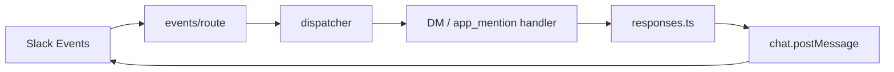

# Slack Response Architecture

### Overview

Phase 6 response layer: foundation handlers call Slack Web API `chat.postMessage` via a dedicated responses module. No AI, memory, or business logic.

### Flow diagram



### Modules

| Module | Responsibility |
|--------|----------------|
| `src/lib/slack/responses.ts` | `sendMessage`, `sendThreadReply`, typed `SlackResponseError`; applies `normalizeSlackMrkdwn` before post |
| `src/lib/slack/mrkdwn.ts` | Presentation adapter: GitHub `**bold**` → Slack `*bold*`, list markers → `•`, headings → bold; preserves code/URLs/mentions |
| `src/lib/slack/client.ts` | WebClient singleton; legacy `postSlackMessage` delegates to responses |
| `events/direct-message.ts` | Foundation DM reply text |
| `events/app-mention.ts` | Foundation mention reply (threaded when `ts` present) |
| `events/handler-utils.ts` | Loop prevention + reply templates |

### Slack mrkdwn (not GitHub Markdown)

- Bold: `*text*` (never `**text**` in the wire payload)
- Bullets: `• item`
- Final AI reply text is normalized only at the Slack adapter boundary (not in tools, prompts, or Conversation Context)
- Confirmation summaries from Timesheet write prepare tools use the same Slack mrkdwn conventions (`*ยืนยัน*` / `*ยกเลิก*`)

### Response APIs

```ts
sendMessage(channel, text, options?)
sendThreadReply(channel, threadTs, text, options?)
```

- Validate non-empty `channel` / `text` / `threadTs`
- Throw `SlackResponseError` with `code` (never include bot token)
- Log failures with `requestId`, `eventId`, `errorCode`, duration
- Handlers catch errors so Event ACK is never blocked by a thrown exception

### Loop prevention

Ignore when any of:

- `bot_id` is set
- `subtype === bot_message`
- any other `subtype` (unsupported in foundation mode)
- missing `user`

Applied in dispatcher and handlers.

### Retry strategy

Phase 6 does **not** auto-retry Slack API calls. Failures are logged with error codes; Slack may redeliver events (idempotent foundation replies are acceptable). Future phases may add bounded retries with jitter for transient codes (`rate_limited`, `timeout`).

### Error handling

| Failure | Behavior |
|---------|----------|
| Invalid args | `SlackResponseError` (`invalid_argument`) |
| Slack `ok: false` | Log `errorCode`; throw `SlackResponseError`; handler catches |
| Network / SDK throw | Log `exception`; handler catches |
| Event ACK | Always already returned 200 before dispatch completes |

### Source Code References

- `src/lib/slack/responses.ts`
- `src/lib/slack/events/direct-message.ts`
- `src/lib/slack/events/app-mention.ts`
