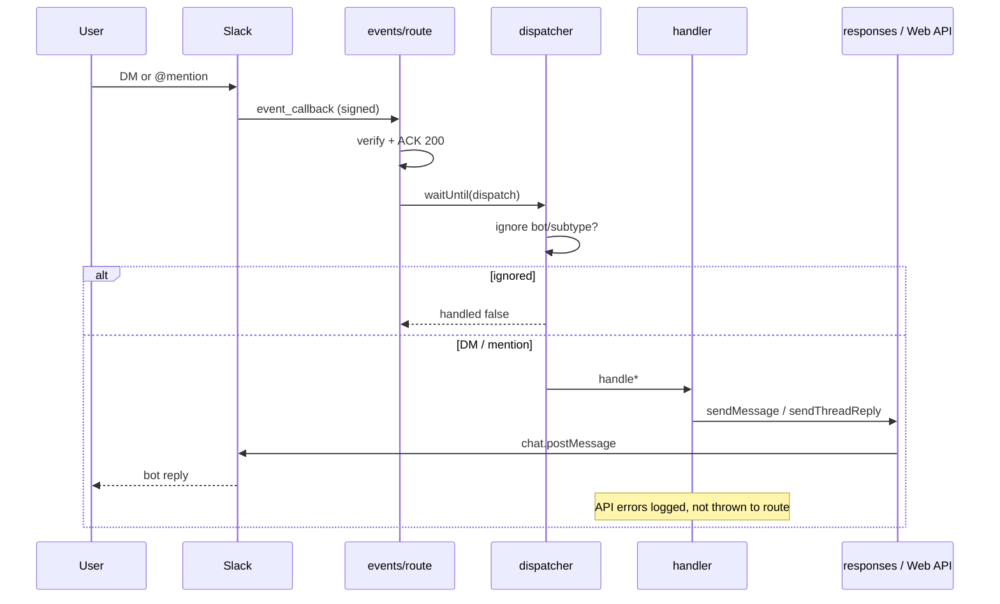

# Slack Response Flow

### Overview

Lifecycle from user message to bot reply in Foundation Mode.

### Sequence diagram



### DM reply (Foundation Mode)

User: `hello`

Bot:

```text
👋 Hello!

AI Timesheet is connected successfully.

Slack integration is working.

(Currently running Foundation Mode.)
```

### App mention reply

User: `@AI Timesheet hello`

Bot (threaded under the mention when `ts` exists):

```text
Hello <@USER_ID> 👋

Slack integration is working.
```

### Logging checkpoints

1. `message received`  
2. `message dispatched` (dispatcher + handler)  
3. `message sent` / Slack API result (responses)  
4. `message reply complete` or `message reply failed` with duration  

Fields: `requestId`, `eventId`, `channel`, `user`, `durationMs`. Never tokens/secrets.

### Source Code References

- `src/lib/slack/dispatcher.ts`
- `src/lib/slack/responses.ts`
- `src/lib/slack/events/handler-utils.ts`
