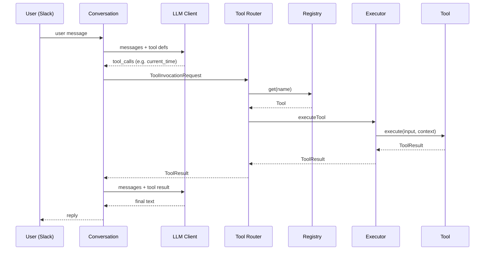

# Tool Architecture

## Purpose

Provide a **vendor-agnostic** tool execution pipeline so Conversation Service can invoke tools without depending on OpenAI-specific concepts beyond an adapter at the LLM client boundary.

## Flow

```text
Slack
  → Conversation Service
  → Tool Router
  → Tool Registry
  → Tool Executor
  → Tool Result
  → OpenAI (final answer)
  → Slack
```

## Sequence



## Modules

| Module | Responsibility |
|--------|----------------|
| `types.ts` | Tool, ToolResult, ToolContext, LLM tool defs |
| `errors.ts` | Typed ToolError codes |
| `tool-context.ts` | Context factory |
| `registry.ts` | DI registry |
| `executor.ts` | Timeout / retry / logging / duration |
| `router.ts` | Validate → find → execute |
| `builtins.ts` | Demo tools only |

## Security model

- Validate tool names (`^[a-z][a-z0-9_]{0,63}$`)
- Reject unknown tools
- No dynamic code execution, eval, shell, or filesystem write in the foundation
- Demo tools perform no network I/O
- Never log secrets

## Source Code References

- `src/lib/tools/`
- `src/lib/ai/conversation.ts`
- `src/lib/ai/client.ts`
