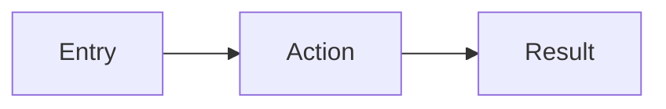

# Manual-ready documentation template

Use this structure for every detailed feature document under `doc/features/<area>/features/`. Content must reflect **implemented** behavior only. Mark unconfirmed items as **Not confirmed in code**.

---

## Feature Name

### Overview

What the feature does from a business or user perspective.

### Business Purpose

Why the feature exists and what problem it solves.

### User Roles and Permissions

| Role | Access | Actions |
|------|--------|---------|
| … | … | … |

Include permission checks, route guards, and middleware from code.

### Workflow

Step-by-step end-to-end flow: entry point → user action → system behavior → API/integration → result.

(Omit diagram when a simple numbered list is clearer.)

### Use Cases

Only use cases supported by code.

### Screen Behavior

For UI screens: page purpose, fields, required/default values, buttons, success/error/empty/loading states.

### Business Logic

Rules extracted from code (hours, leave/holiday blocking, ID generation, replace-on-submit, etc.).

### Validation Rules

Required fields, formats, min/max, dates — frontend and backend, with authority noted.

### Edge Cases

Missing data, invalid input, API failure, duplicate submission, permission denied, empty results — only if handled in code.

### API and Integration Behavior

How `/api/*` routes and upstream calls (Zoho, Sheets, Slack, SMTP) support the workflow. Request/response behavior, error handling.

### Data Model Summary

Key types/fields involved (`src/types/`, sheet columns).

### Status Lifecycle

Only if statuses or multi-step states exist.

### Operation Notes

Cron schedules, env vars, Redis, service accounts — for operators.

### Known Limitations

Documented gaps or fragile assumptions.

### Source Code References

- Pages, components, API routes, lib modules

### Required tests

List behaviors that must remain covered when a test runner exists.
