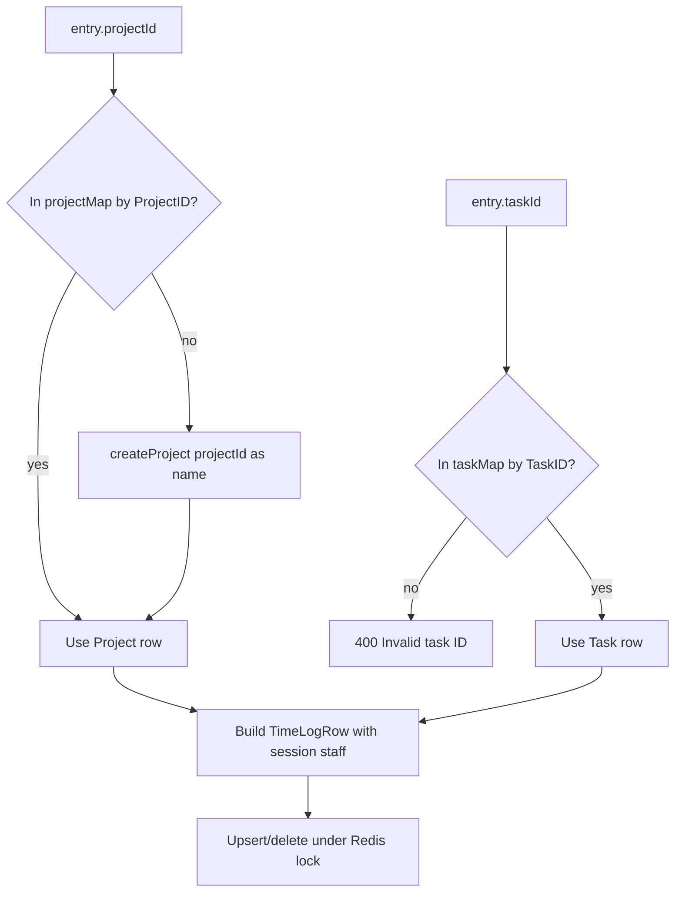

# 04 — Project & Task Resolution

How the system identifies Project, Task, User, and Department **without AI guessing** — from code only.

---

## Project entities

| Item | Value |
|------|--------|
| Type | `Project` in `src/types/index.ts` |
| Fields | `ProjectID`, `ProjectClient`, `ProjectName`, `ProjectCode` |
| Storage | Google Sheets tab `Projects`, range `A2:D` |
| Loader | `GoogleSheetsService.getProjects` / `getCachedProjects` |
| API | `GET /api/master/projects` → `{ projects, clients }` |

### How backend identifies a project on write

```text
File: src/app/api/timesheet/submit/route.ts
Behavior:
  1. Build projectMap from getCachedProjects() keyed by ProjectID.
  2. For each entry.projectId:
     - If projectMap.has(projectId) → use that Project row.
     - Else treat projectId as a custom project **name** → createProject(name)
       → new ProjectID (max numeric ID + 1), ProjectClient='*New',
         ProjectCode=`NEW-${name}`.
  3. Time Log stores resolved Project ID/Client/Name/Code — not the temporary custom string.
```

**There is no fuzzy match, no name search API, no employee–project assignment table.**  
Resolution is exact `ProjectID` string match, or “not found ⇒ create as name”.

### Lookup APIs

| API | Search? | Returns |
|-----|---------|---------|
| `GET /api/master/projects` | **No** — full list | All projects + client strings |

**Search APIs for projects:** **Not found.**

---

## Task entities

| Item | Value |
|------|--------|
| Type | `Task` |
| Fields | `TaskID`, `Task` (display name) |
| Storage | Sheets tab `Roles and Tasks`, range `A2:B` |
| Loader | `getTasks` / `getCachedTasks` |
| API | `GET /api/master/tasks` |

### How backend identifies a task on write

```text
File: src/app/api/timesheet/submit/route.ts
Behavior:
  taskMap = Map(TaskID → Task)
  If !taskMap.has(entry.taskId) → HTTP 400 "Invalid task ID: {id}"
  Task display name taken from taskMap for Time Log column "Task"
```

**No project–task relationship.** Any valid `TaskID` may be paired with any project.  
**No search API** — full list only.

Sheet name “Roles and Tasks” does not imply role-based filtering in code.

---

## User identification

| Step | Mechanism | Code |
|------|-----------|------|
| Sign-in | Google OAuth email | `src/lib/auth.ts` |
| Domain gate | `email.endsWith('@shopstack.asia')` | `auth.ts` `signIn` |
| HR identity | `ZohoPeopleService.getEmployeeByEmail(email)` | `zoho-people.ts` |
| Session | JWT stores `StaffProfile` | `auth.ts` jwt/session callbacks |
| API identity | `getServerSession` → `session.staffProfile.EmployeeID` | all timesheet/staff routes |
| Time Log ownership | Written/read filtered by `Staff ID` = EmployeeID | get + submit |

**StaffProfile fields used for identity/writes:** `EmployeeID`, `FirstName`, `LastName`, `Position`, `Email`, optional `Location` (holidays).  
`Nickname` is on the type but not written to Time Log in submit mapping.

**There is no API parameter to select another user.** Impersonation / manager-on-behalf: **Not found**.

---

## Department

| Question | Finding |
|----------|---------|
| Department entity in types? | **Not found** |
| Department field on StaffProfile? | **Not found** |
| Department filter on projects/tasks/time log? | **Not found** |
| Closest related field | `Position` (job title string from Zoho) and `Location` (holiday location) |

Backend **cannot** resolve Department for timesheet operations because Department is not modeled in this codebase.

---

## Client (related resolution)

| Item | Finding |
|------|---------|
| Client entity | Not a separate table — `ProjectClient` string on Project |
| UI | User selects client first; projects filtered client-side in `TimeEntryForm` |
| Submit API | Does **not** receive client; derives client from resolved Project |

AI must not invent clients; obtain from `clients` array or `Project.ProjectClient`.

---

## Resolution flowchart (submit)



---

## Implications for AI (facts only)

1. Prefer **IDs** (`ProjectID`, `TaskID`) obtained from list APIs — not free-text names — except the intentional custom-project path.  
2. Free-text `projectId` that is not an ID **creates a new Projects row**.  
3. Free-text task names that are not IDs **fail** with 400.  
4. User is always the session employee — no department routing.  
5. No search APIs exist; listing + exact match is the only supported resolution path in code.
