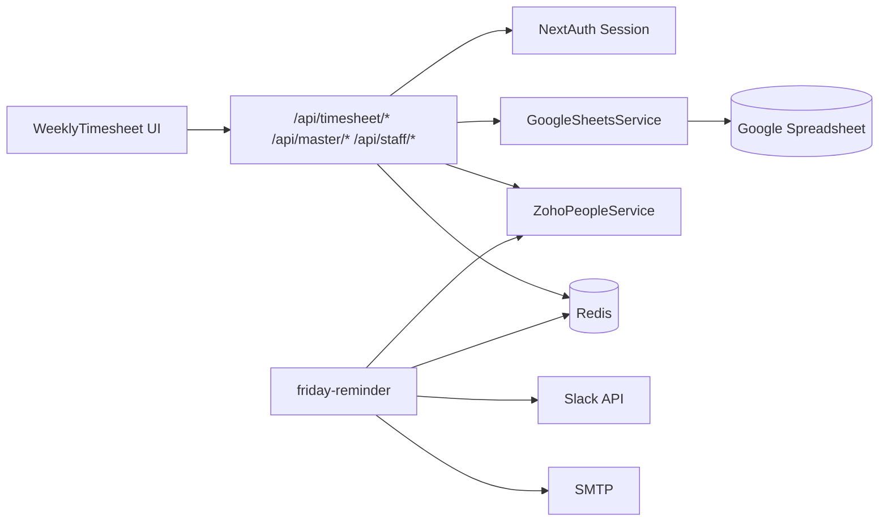

# 01 — Timesheet System Overview

**Confidence:** Confirmed by code (unless marked otherwise)

---

## Business purpose

Shopstack Timesheet lets **Shopstack employees** (`@shopstack.asia`) log weekly project/task hours and persist them to a shared **Google Sheets Time Log**. Leave and holiday context is shown from **Zoho People**. A Friday cron reminds staff by email and Slack.

There is **no** manager approval, period lock, billing flag, or in-app reporting in this codebase.

---

## Primary users

| User | How identified | Capability |
|------|----------------|------------|
| Employee | Google SSO + Zoho staff profile | View/edit/submit own weekly timesheet |
| Cron / operator | `Authorization: Bearer ${CRON_SECRET}` | Run reminder and holiday refresh |
| (Implicit) Sheet editors | Google Sheets sharing | Can manually edit Sheets outside the app — **not** modeled in app |

**Not found:** Manager, HR, Finance, Admin app roles.

---

## Main use cases (implemented)

1. Sign in with Google (`@shopstack.asia`) and load Zoho profile
2. Navigate Monday–Sunday week
3. Load existing Time Log rows for self
4. Add/edit/delete time entries in browser state
5. Copy previous day’s entries
6. Submit week (sequential per-day POSTs → Sheets upsert/delete)
7. Create custom project under client `*New` on submit
8. See leave (full-day disable edit) and holidays (visual only)
9. Receive Friday blast reminder (email + Slack)

---

## System boundaries

```text
┌─────────────────────────────────────────────────────────────┐
│  Browser (Next.js client components)                        │
│  /timesheet UI → fetch /api/* only                          │
└───────────────────────────┬─────────────────────────────────┘
                            │ same-origin /api/*
┌───────────────────────────▼─────────────────────────────────┐
│  Next.js Route Handlers (BFF) + src/lib/*                   │
│  Session auth · Zod · Sheets · Zoho · Redis                 │
└───────┬─────────────┬──────────────┬────────────┬───────────┘
        │             │              │            │
   Google Sheets  Zoho People     Redis      Slack/SMTP
   (datastore)    (HR identity,  (cache +   (reminders)
                   leave,         write lock)
                   holidays)
```

**Inside boundary:** This Next.js app.  
**Outside boundary:** Spreadsheet governance, Zoho HR configuration, Slack workspace, SMTP provider, any billing/payroll that may read the sheet offline.

---

## Upstream systems

| System | Data consumed |
|--------|----------------|
| Google Identity | OAuth identity (email) |
| Zoho People | Employee profile, leave records, holidays, employee list for reminders |
| Google Sheets | Projects, tasks, Time Log reads |

---

## Downstream systems

| System | Data produced |
|--------|----------------|
| Google Sheets Time Log / Projects | Written on submit / custom project create |
| Redis | Leave cache, holiday cache, write lock |
| SMTP | Friday reminder emails (optional) |
| Slack | Friday channel reminders (optional) |

---

## Main modules

| Module | Path | Responsibility |
|--------|------|----------------|
| Auth | `src/lib/auth.ts`, `src/app/api/auth/` | Google SSO + Zoho gate |
| Timesheet UI | `src/app/timesheet/`, `src/components/` | Week editor |
| Timesheet API | `src/app/api/timesheet/` | Get, submit, holidays |
| Master data | `src/app/api/master/`, Sheets Projects + Roles and Tasks | Project/task catalogs |
| Staff / leave | `src/app/api/staff/` | Profile + leave |
| Sheets service | `src/lib/google-sheets.ts` | R/W Sheets |
| Zoho | `src/lib/zoho-people.ts`, `src/lib/zoho/` | People API |
| Redis | `src/lib/redis.ts`, locks, caches | Cache + lock |
| Reminders | `src/app/api/cron/friday-reminder/` | Blast notifications |

---

## High-level process lifecycle (actual)

Confirmed by UI + submit route + Sheets service:

```text
Employee signs in (Google @shopstack.asia + Zoho profile)
→ Opens /timesheet (Monday-start week)
→ App loads projects/tasks from Sheets (cached 5 min)
→ App loads own Time Log rows for week from Sheets
→ App loads leave (Zoho/Redis) and holidays (Redis)
→ Employee edits entries in client state (draft — not persisted yet)
→ Optional: Copy Yesterday into empty day
→ Employee clicks Submit Week
→ Client validates projectId, taskId, hours > 0
→ Client POSTs each day with entries sequentially to /api/timesheet/submit
→ Server validates Zod + task IDs; acquires Redis Time Log write lock
→ Server deletes removed Project|Task rows for that day; upserts remaining
→ Optional: creates Projects row for custom *New project names
→ Lock released; client reloads week from Sheets
→ (No approval, no period lock, no billing handoff in app)
```

**Friday (UTC 00:00):** Cron refreshes holiday cache (best effort) and emails/Slacks all `@shopstack.asia` employees a generic reminder — does **not** check incomplete timesheets.

---

## High-level architecture



---

## Main business entities

| Entity | Storage | Notes |
|--------|---------|-------|
| StaffProfile | JWT session (from Zoho) | EmployeeID, name, email, position, location |
| Project | Sheets `Projects!A2:D` | ID, client, name, code |
| Task | Sheets `Roles and Tasks!A2:B` | TaskID, Task name |
| TimeEntry (UI) | Client state → Sheets Time Log | projectId, taskId, hours |
| TimeLogRow | Sheets `Time Log!A:M` | Denormalized staff + project + task + hours |
| LeaveDayEntry | Zoho + Redis cache | FULL/HALF per date |
| Holiday | Zoho + Redis cache | Per location/year |

---

## Main statuses

**Timesheet entry / period statuses:** **Not implemented.** There is no Draft/Submitted/Approved/Rejected enum. Persistence is “present in Time Log sheet” vs “not present.” Client edits before submit are ephemeral.

**Leave statuses (from Zoho, stored on LeaveDayEntry):** `ApprovalStatus` string (e.g. Approved, Pending, Cancelled, Rejected) is **copied through** but **not filtered** when deciding UI leave blocking.

**Holiday:** `is_holiday` boolean on `Holiday`.

---

## Main integrations

| Integration | Status |
|-------------|--------|
| Google OAuth | Active |
| Google Sheets | Active (primary datastore) |
| Zoho People | Active |
| Redis / Upstash / Vercel KV | Active (required for leave cache + submit lock) |
| Slack | Optional (reminders + debug) |
| SMTP | Optional (reminders + debug) |
| Jira / Calendar / Payroll | Not found |

---

## Current limitations (summary)

- No approval workflow or manager views
- No RBAC beyond “signed-in employee owns own EmployeeID rows”
- Leave/holiday do not block server submit
- Holidays do not disable editing
- No reporting/export in app
- Sheets concurrency controlled only by Redis write lock on submit
- Re-submit freely overwrites/deletes same-day rows (no business period lock)

See [19_GAPS_AMBIGUITIES_AND_TECHNICAL_DEBT.md](./19_GAPS_AMBIGUITIES_AND_TECHNICAL_DEBT.md).
