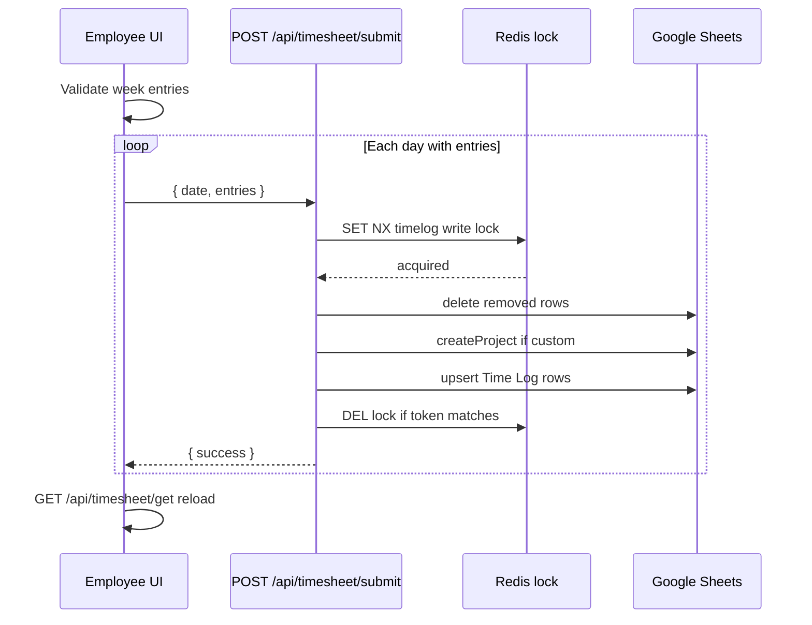
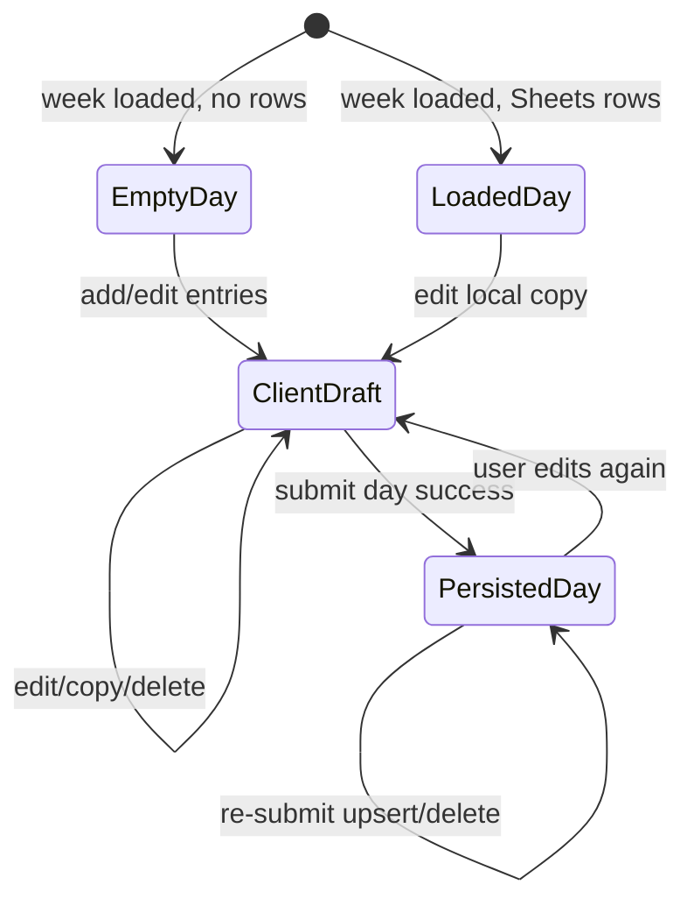

# 04 — Business Workflows

**Confidence:** Confirmed by code for implemented workflows; **Not implemented** explicitly marked.

---

## Workflow index

| ID | Name | Status |
|----|------|--------|
| WF-01 | Create time entry (draft) | Implemented |
| WF-02 | Edit time entry (draft) | Implemented |
| WF-03 | Delete time entry (draft) | Implemented |
| WF-04 | Copy previous day entries | Implemented |
| WF-05 | Submit weekly timesheet (per-day POSTs) | Implemented |
| WF-06 | Persist / replace day on Sheets | Implemented |
| WF-07 | Create custom project on submit | Implemented |
| WF-08 | Load week with leave & holidays | Implemented |
| WF-09 | Friday reminder notification | Implemented |
| WF-10 | Holiday cache refresh | Implemented |
| WF-11 | Approve timesheet | **Not implemented** |
| WF-12 | Reject / return / resubmit workflow | **Not implemented** |
| WF-13 | Lock / unlock period | **Not implemented** |
| WF-14 | Export / report | **Not implemented** |
| WF-15 | Manager creates entry for employee | **Not implemented** |
| WF-16 | Import timesheet | **Not implemented** |
| WF-17 | Overtime / leave-as-entry | **Not implemented** |

---

## WF-01 Create time entry (draft)

```text
Workflow ID: WF-01
Workflow Name: Create time entry (client draft)
Actor: authenticated_employee
Trigger: Click "+ Add Entry" on DailyCard
Preconditions: Day is not full leave; not submitting
Input: None (empty entry scaffold)
Main Flow:
  1. WeeklyTimesheet.handleAddEntry pushes TimeEntry { id: Date.now(), projectId:'', taskId:'', hours:0 }
  2. TimeEntryForm renders; user selects Client → Project → Task → Hours
  3. onUpdate writes back into timesheet state
Alternative Flow: Full leave → button disabled labeled "Leave Day"
Validation: Touched-field UI validation (client/project/task/hours>0); not persisted yet
Permission: Own UI session only
State Transition: ephemeral draft in React state
Side Effects: None server-side
Notifications: None
Error Handling: N/A
Output: Updated DailyTimesheet.entries
Code References:
  Repository: shopstack-timesheet
  File: src/components/WeeklyTimesheet.tsx — handleAddEntry
  File: src/components/DailyCard.tsx — Add Entry button
  File: src/components/TimeEntryForm.tsx
```

---

## WF-02 Edit / WF-03 Delete (draft)

Same actor and storage (client state). Delete removes entry index and recalculates `totalHours`. Disabled when `isFull` leave.

---

## WF-04 Copy yesterday

```text
Workflow ID: WF-04
Workflow Name: Copy Yesterday
Actor: authenticated_employee
Trigger: "Copy Yesterday" on DailyCard
Preconditions: dayIndex > 0; current day has 0 entries; not full leave; not submitting
Input: Previous day’s entries
Main Flow:
  1. Clone yesterday.entries with new ids
  2. Append to current day; recompute totalHours
Alternative Flow: Button hidden if preconditions fail
Validation: None beyond preconditions
Permission: Client-only
State Transition: draft entries appended
Side Effects: None
Output: Copied entries ready for submit
Code: WeeklyTimesheet.handleCopyYesterday; DailyCard conditional render
```

---

## WF-05 / WF-06 Submit week → Sheets

```text
Workflow ID: WF-05 / WF-06
Workflow Name: Submit Week
Actor: authenticated_employee
Trigger: "Submit Week"
Preconditions: weekTotalHours > 0; every entry has projectId, taskId, hours > 0
Input: timesheet days with entries
Main Flow:
  1. Client rejects empty week or incomplete fields (alert)
  2. submitWeekDaysSequentially filters days with entries.length > 0
  3. For each day: POST /api/timesheet/submit { date, entries }
  4. Server: session + Zod + taskMap validation
  5. withTimeLogWriteLock:
     a. Load existing rows for date+staff
     b. Delete rows whose ProjectID|TaskID not in submission
     c. For unknown projectId strings: createProject(name)
     d. appendOrUpdateTimeLogEntries
  6. On all success: alert + GET reload week
Alternative Flow:
  - One day fails → continue remaining days; alert failed dates
  - Lock timeout / Redis down → 503 with retry message
Validation: See TS-BR-* in doc 07
Permission: Writes as session EmployeeID only
State Transition: Sheets rows upserted/deleted (no status field)
Side Effects: Possible Projects sheet append; Redis lock acquire/release; cache clear on createProject
Notifications: None on submit success
Error Handling: 400/401/503/500 ApiResponse.error; client alerts
Output: success true or partial failures
Code:
  File: src/components/WeeklyTimesheet.tsx — handleSubmitWeek
  File: src/lib/submit-week-days.ts
  File: src/app/api/timesheet/submit/route.ts
  File: src/lib/sheets-write-lock.ts
  File: src/lib/google-sheets.ts — appendOrUpdateTimeLogEntries, deleteTimeLogEntries
```

### Sequence diagram



---

## WF-07 Custom project on submit

When `projectId` is not found in Projects map, treat as custom name:

1. `createProject(projectName)` → next numeric ID, client `*New`, code `NEW-{name}`
2. Map custom name → new ProjectID for Time Log row
3. `clearSheetsCache()`

**Code:** `GoogleSheetsService.createProject`, submit route custom project loop.

---

## WF-08 Load week context

Parallel concerns in `WeeklyTimesheet`:

1. Initialize 7 empty days for Monday week
2. `GET /api/master/projects` + `/tasks`
3. `GET /api/timesheet/get?weekStart=`
4. `GET /api/staff/leave/monthly` for months spanning week
5. `GET /api/timesheet/holidays?year=` for years spanning week (Redis only)

---

## WF-09 Friday reminder

```text
Trigger: Vercel cron 0 0 * * 5 UTC → POST /api/cron/friday-reminder
Auth: Bearer CRON_SECRET
Main Flow:
  1. refreshHolidayCache() best-effort
  2. getAllEmployees(); filter @shopstack.asia emails
  3. If SMTP configured: email each employee generic reminder + link
  4. If Slack configured: post to channel ID(s) with @channel
Does NOT: check who submitted; personalize missing hours
```

---

## WF-10 Holiday cache refresh

`POST/GET /api/cron/refresh-holidays` with Bearer secret → `refreshHolidayCache()` for all employee locations × years (prev/current/next) → Redis `holiday:{location}:{year}` TTL ~1 year.

Also invoked from Friday reminder (non-fatal on failure).

---

## Not implemented workflows (WF-11+)

No APIs, UI, statuses, or notifications exist for approval, rejection, return-for-correction, period lock/unlock, manager proxy entry, import, export, overtime entry types, or billing handoff.

---

## State diagram (actual)

There is no formal timesheet status machine. Practical states:



Leave overlay (UI only): `Editable` vs `FullLeaveDisabled` does not map to Sheets status.
