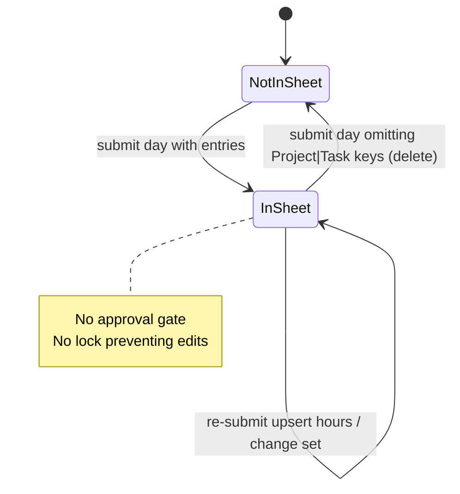

# 06 — Submission and Approval

**Confidence:** Confirmed by code

---

## Submission unit

| Aspect | Actual behavior |
|--------|-----------------|
| UI unit | **Week** (Submit Week button) |
| API unit | **Day** (`POST /api/timesheet/submit` with one `date`) |
| Transport | One sequential POST per day that has entries |

Month/custom period submission: **Not implemented**.

---

## Submission cut-off

**Not implemented.** No deadline, no Friday-only rule, no block after cron reminder.

Reminder email text says “Monday - Friday” but the app allows Saturday/Sunday entries and any calendar date.

---

## Submitter

Authenticated employee (`session.staffProfile`). Always submits as self.

---

## Approver / hierarchy / delegation / escalation

**Not implemented.** No approver role, inbox, comments, or multi-level flow.

---

## Rejection reason / resubmission / approval comments / history

**Not implemented.**

Re-submission of the same day is always allowed: upsert/delete against Sheets. This is **overwrite**, not a formal “resubmit after reject” workflow.

---

## Period locking / unlocking

| Kind | Status |
|------|--------|
| Business period lock after submit/approve | **Not implemented** |
| Redis `timesheet:sheets:timelog:write` lock | **Implemented** — technical concurrency lock during write only (TTL 90s) |

---

## Auto-approval / auto-submission

**Not implemented.** Friday job only sends reminders.

---

## Approval notifications

**Not implemented.**

---

## Status transition model (actual)

There are **no** Draft/Submitted/Approved/Rejected statuses in types or Sheets columns.



If a formal status model is required for MCP/AI, it must be **designed new** — it does not exist here.

---

## Client submit behavior details

```text
Repository: shopstack-timesheet
File: src/components/WeeklyTimesheet.tsx
Function: handleSubmitWeek
Behavior: Validates all days; posts only days with entries.length > 0; continues after failures; reloads on full success.
```

```text
File: src/lib/submit-week-days.ts
Function: submitWeekDaysSequentially
Behavior: Filters empty days; sequential await; catches per-day exceptions.
```

---

## Server replace semantics

For a given `(date, staffId)`:

1. Existing Sheets rows keyed by `Project ID|Task ID`
2. Keys not present in request body → **delete row**
3. Keys present → **upsert** by Time Log ID / composite key
4. `entries: []` → delete all for that day (supported by API; not used by current UI week submit for empty days)

---

## Implications for future approval design

Any approval workflow would be greenfield relative to this codebase: new statuses, APIs, permissions, and likely a store other than free-form Sheets edits.
