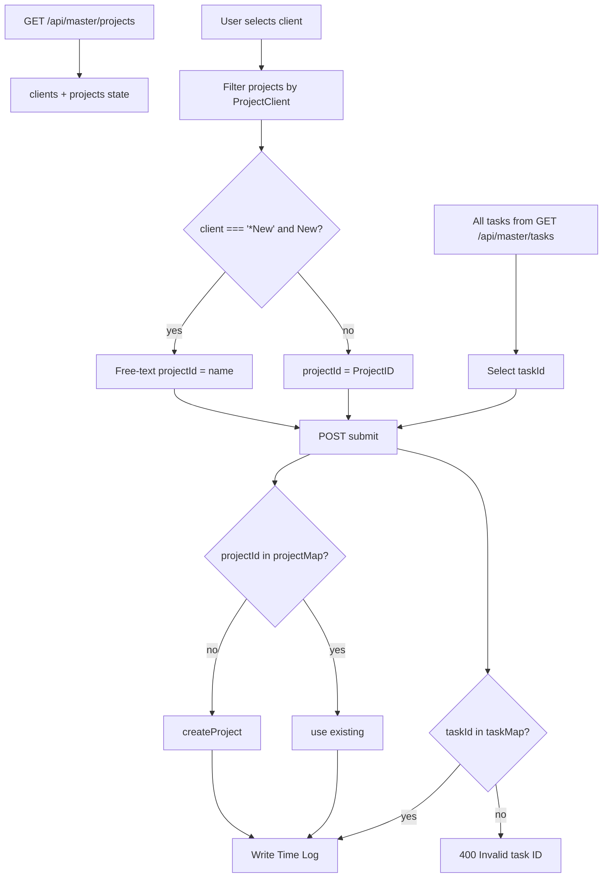

# 08 — Project, Task, and Assignment Logic

**Confidence:** Confirmed by code

---

## How projects become available

1. Service account reads Google Sheet tab **`Projects`** range `A2:D`.
2. Mapped to `{ ProjectID, ProjectClient, ProjectName, ProjectCode }`.
3. Cached in-process for **5 minutes** (`getCachedProjects`).
4. `GET /api/master/projects` returns `{ projects, clients }` where clients are unique sorted `ProjectClient` values.
5. UI shows **all** projects to every authenticated user.

**Employee–project assignment:** **Not implemented.**

---

## Project sheet columns

| Column | Index | Field |
|--------|-------|-------|
| A | 0 | ProjectID |
| B | 1 | ProjectClient |
| C | 2 | ProjectName |
| D | 3 | ProjectCode |

Empty rows (missing A) filtered out.

---

## Custom / *New projects

```text
Repository: shopstack-timesheet
File: src/lib/google-sheets.ts
Function: createProject(projectName)
Behavior: Next numeric ProjectID = max(parseInt IDs)+1; ProjectClient='*New'; ProjectCode=`NEW-${projectName}`; append row; clearSheetsCache().
```

UI path:

1. Select client `*New` (must exist as a client value in sheet data — typically from existing `*New` rows).
2. Click **New** → text input writes custom name into `projectId`.
3. On submit, if `projectId` not in map → `createProject`.

---

## Tasks

| Source | Sheet `Roles and Tasks` `A2:B` |
|--------|--------------------------------|
| Fields | TaskID, Task |
| API | `GET /api/master/tasks` → `Task[]` |
| Filtering | **None** by project, role, or employee |
| Note | Sheet name implies roles; code treats rows as a flat task list only |

**Employee–task assignment:** **Not implemented.**  
**Project–task mapping:** **Not implemented.**

---

## Project membership / team / PM ownership

**Not found** in application code.

---

## Project / task active period and status

**Not found.** No active flag, archive flag, or date range checks on submit. Inactive/archived behavior is **undefined** at app layer (whatever rows exist in Sheets are usable).

---

## Client mapping

- Client is `ProjectClient` on the project row.
- UI requires selecting client before project list appears.
- Client is **not** stored on `TimeEntry`; denormalized onto Time Log from project at submit.

---

## Cost center / billable / internal / leave / holiday projects

**Not implemented** as first-class types. Any such distinction would be conventional naming inside Sheets data only — not enforced by code.

---

## Default project

**Not implemented.**

---

## Unassigned / cross-project work

Users may log any combination of projects freely. Multiple projects per day allowed as separate entries.

---

## Archived project behavior

**Undefined** in code. If row remains in Projects sheet, it remains selectable.

---

## Selection logic trace (UI + backend)



---

## Related code references

| Concern | File |
|---------|------|
| Read projects/tasks | `src/lib/google-sheets.ts` |
| Master APIs | `src/app/api/master/projects/route.ts`, `tasks/route.ts` |
| Form cascade | `src/components/TimeEntryForm.tsx` |
| Custom create on submit | `src/app/api/timesheet/submit/route.ts` |
