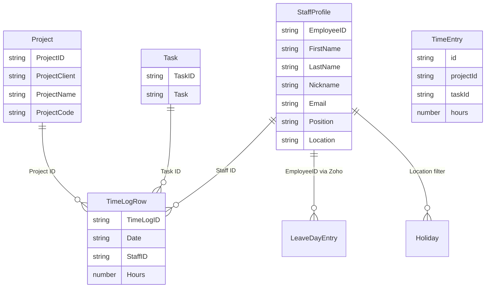

# 10 — Data Model and Field Dictionary

**Confidence:** Confirmed by TypeScript types + Sheets access code. **No RDBMS / ORM / migrations** in repository.

---

## Entity relationship overview

Persistence: **Google Spreadsheet** tabs + **Redis** caches/locks + **JWT** for profile.

---

## Table / sheet inventory

| Store | Name | Role |
|-------|------|------|
| Sheets | `Projects` | Master projects |
| Sheets | `Roles and Tasks` | Master tasks |
| Sheets | `Time Log` | Submitted hours |
| Redis | `leave:{employeeId}:{from}:{to}` | Cached Zoho leave JSON |
| Redis | `holiday:{location}:{year}` | Cached holidays |
| Redis | `holiday:default:{year}` | Default holidays (read path) |
| Redis | `timesheet:sheets:timelog:write` | Write lock token |
| JWT | session token | StaffProfile |

---

## Field dictionary — Time Log (Sheets A–M)

| Entity | Field | Database Type | Application Type | Nullable | Default | Validation | Description |
| ------ | ----- | ------------- | ---------------- | -------: | ------- | ---------- | ----------- |
| TimeLogRow | Time Log ID | cell string | string | no | SHA-256 16 hex | generated | Hash of date\|staff\|project\|task |
| TimeLogRow | Date | cell | string YYYY-MM-DD | no | — | submit regex; read normalize | Work date |
| TimeLogRow | Staff ID | cell | string | no | session | — | Zoho EmployeeID |
| TimeLogRow | Staff First Name | cell | string | | session | | |
| TimeLogRow | Staff Last Name | cell | string | | session | | |
| TimeLogRow | Staff Position | cell | string | | session | | |
| TimeLogRow | Project ID | cell | string | no | project | | |
| TimeLogRow | Project Client | cell | string | | project | | |
| TimeLogRow | Project Name | cell | string | | project | | |
| TimeLogRow | Project Code | cell | string | | project | | |
| TimeLogRow | Task ID | cell | string | no | task | must exist | |
| TimeLogRow | Task | cell | string | | task | | |
| TimeLogRow | Hours | cell number | number | no | | 0–24 Zod | |

Indexes/unique: **Application-level** uniqueness via Time Log ID / composite key — not a DB unique constraint.

Soft-delete: physical row **delete** via Sheets `deleteDimension`.

Audit/version columns: **Not found**.

---

## Field dictionary — Projects / Tasks

| Entity | Field | Type | Notes |
|--------|-------|------|-------|
| Project | ProjectID | string | Often numeric string; next ID = max+1 |
| Project | ProjectClient | string | Client grouping; `*New` special UX |
| Project | ProjectName | string | |
| Project | ProjectCode | string | Custom → `NEW-{name}` |
| Task | TaskID | string | |
| Task | Task | string | Display name |

---

## UI models

| Entity | Field | Notes |
|--------|-------|-------|
| TimeEntry | id, projectId, taskId, hours | projectId may be custom name pre-submit |
| DailyTimesheet | date, entries, totalHours | totalHours derived client-side |
| WeeklyTimesheet | weekStart, days, totalHours | Type exists; page uses day array state |

---

## Leave / Holiday

| Entity | Field | Notes |
|--------|-------|-------|
| LeaveDayEntry | date, type FULL\|HALF, dayType, leaveType, reason, status, approvedBy? | From Zoho normalize |
| ZohoLeaveRecord | ApprovalStatus, Days map, etc. | External |
| Holiday | id, name, date, shift_name?, location_name?, remarks?, is_holiday | Cached |

---

## Enum dictionary

| Name | Values | Where |
|------|--------|-------|
| Leave type (normalized) | `FULL`, `HALF` | LeaveDayEntry |
| dayType examples | `FULL_DAY`, `FIRST_HALF`, `SECOND_HALF`, `HALF_DAY` | leave-utils |
| ViewMode | `column`, `tab` | UI localStorage |
| SheetsWriteLockError.code | `LOCK_TIMEOUT`, `REDIS_UNAVAILABLE` | sheets-write-lock |
| Timesheet status enum | — | **Not implemented** |

---

## Relationship matrix

| From | To | Cardinality | Mechanism |
|------|-----|-------------|-----------|
| Staff | TimeLogRow | 1:N | Staff ID column |
| Project | TimeLogRow | 1:N | Project ID |
| Task | TimeLogRow | 1:N | Task ID |
| Project | Task | N:N unconstrained | No link table |
| Staff | Project | N:N unconstrained | No assignment |

---

## Lifecycle field mapping

| Lifecycle moment | Fields written |
|------------------|----------------|
| Sign-in | JWT StaffProfile from Zoho |
| Draft edit | TimeEntry in React state only |
| Submit | Full TimeLogRow columns; optional new Project row |
| Delete entry key | Row removed from Time Log |
| Leave fetch | Redis leave key or Zoho → LeaveDayEntry[] |
| Holiday refresh | Redis holiday keys |
