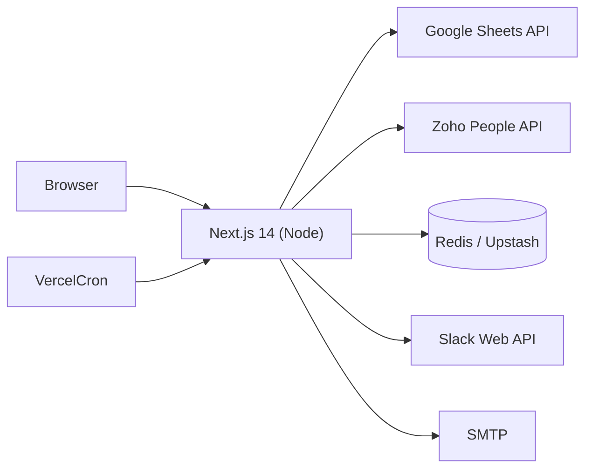
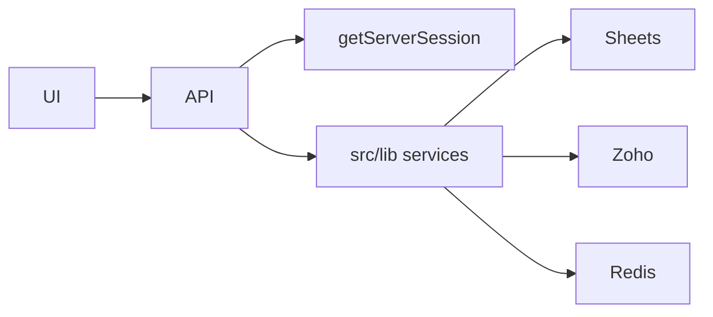

# 17 — Technical Architecture

**Confidence:** Confirmed by code

---

## Repository structure

```text
shopstack-timesheet/
├── src/
│   ├── app/                 # Next.js App Router pages + API routes
│   ├── components/          # Client timesheet UI
│   ├── contexts/            # ThemeProvider
│   ├── lib/                 # Server integrations & helpers
│   ├── types/               # Shared TypeScript types
│   └── middleware.ts        # NextAuth middleware export
├── doc/                     # Engineering feature docs (agents)
├── docs/timesheet/          # This analysis package
├── vercel.json              # Cron
├── vitest.config.ts
└── package.json
```

Single deployable Next.js application — no separate worker service repo in workspace.

---

## Runtime architecture



---

## Frontend architecture

- React 18 client components for timesheet (`'use client'`)
- NextAuth `SessionProvider` + `ThemeProvider` in `providers.tsx`
- State: React `useState` / `useRef` caches; no Redux
- Calls **same-origin `/api/*` only** (BFF)

---

## Backend architecture

- Route Handlers under `src/app/api/**/route.ts`
- Domain logic in `src/lib/*` (not a formal hexagonal layout)
- Validation: Zod on submit
- Response shape: `ApiResponse<T>`



No classic Repository/ORM layer — Sheets service acts as persistence adapter.

---

## Database technology / ORM

| Item | Reality |
|------|---------|
| RDBMS | Not used |
| ORM | Not used |
| Primary data store | Google Sheets |
| Cache / lock | Redis |

---

## Event handling / queue

HTTP cron triggers only. No message queue, no domain events bus.

---

## Cache

| Cache | Scope | TTL |
|-------|-------|-----|
| Projects/tasks | In-process memory | 5 minutes |
| Leave | Redis | 21600 s |
| Holidays | Redis | ~1 year |
| `src/lib/cache.ts` | Generic memory helper | **Unused** (no imports found) |

---

## Authentication

NextAuth Google provider, JWT strategy, custom pages, Zoho enrichment — see doc 03.

---

## Deployment assumptions

- Vercel-compatible (`vercel.json` crons)
- Env vars per `.env.example`
- Serverless-friendly: Redis lock added to serialize Sheets writes across instances

---

## Configuration / environment variables

See `.env.example` and `doc/features/ops/features/environment-variables.md`. Groups: NextAuth, Google OAuth, Sheets service account, Zoho, Cron secret, optional Slack/SMTP, Redis URL or KV REST.

---

## Logging / monitoring

Console logging only in-app. Platform monitoring depends on host (not coded).

---

## External dependencies (runtime)

`next`, `react`, `next-auth`, `googleapis`, `axios`, `zod`, `date-fns`, `@upstash/redis`, `ioredis`, `@slack/web-api`, `nodemailer`, Tailwind stack.

---

## Test runner

Vitest (`npm test`) — currently two unit test files for pure helpers.
